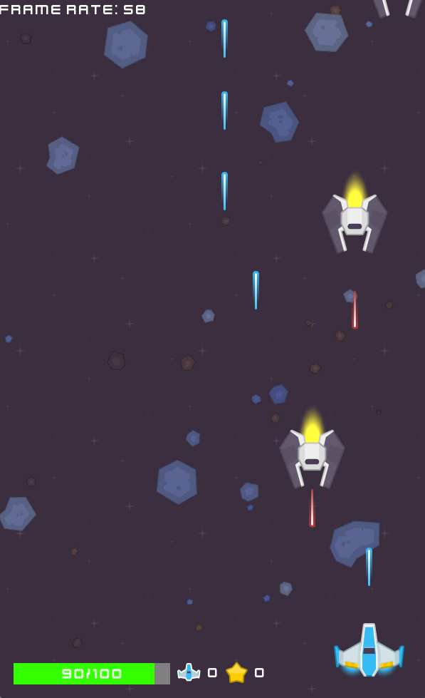
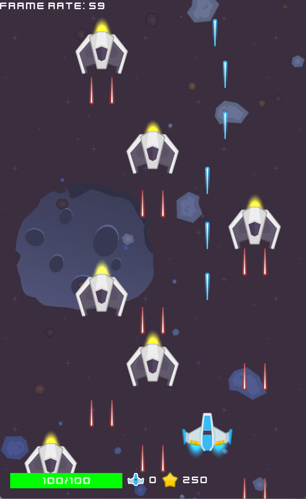

# Light Years 


A high-performance 2D space shooter with custom engine architecture, featuring dynamic lighting, advanced physics, and procedurally managed enemy waves.

---

## Introduction

**Light Years** is a modern C++17 space shooter game built from the ground up with a custom game engine. The player commands a hero spaceship against waves of enemy space ships through procedurally managed stages, culminating in boss battle and lastly infinite stage.
**Project Origin & Evolution:**
This project initially started as part of the **[Learn C++ and Make a Game from Scratch](https://www.udemy.com/course/complete-game-development-series-04-making-a-game-with-c/learn/lecture/40817092#overview)** on Udemy. Then I added such as shaders, sound system, parallax system ect.
 
You can download the game from this repository folder named "LightYears.7z" or from
[itch.io](https://parsik4.itch.io/light-years).

The project demonstrates professional game development practices including:
- **Custom Engine Architecture** (Entity-Component System)
- **Advanced Memory Management** (Smart Pointers, Object Pooling)
- **Real-time Physics** (Box2D 3.x Integration)
- **Dynamic Lighting System** (GLSL Shader Pipeline)
- **Optimized Rendering** (Lazy Sorting, Batch Drawing)

---

## Security & Antivirus Verification

**Important Notice:** This is an **unsigned executable** from an independent developer. Windows Defender may show a SmartScreen warning.

**VirusTotal Scan Results:**
- **Verified Clean** by 60+ antivirus engines
- [View Full VirusTotal Report](https://www.virustotal.com/gui/file/c860514a1a724c28256f4c11d9118023c3ee707371953c9baf50399e572bde64/detection)

*Note: Any generic "suspicious" flags are **false positives** common to unsigned C++ games.*

---

## Key Features

### Gameplay
- **5 Enemy Types** with unique AI behaviors (Vanguard, TwinBlade, Hexagon, UFO, Boss)
- **3 Weapon Systems** (Single Shot, Three-Way, Frontal Wiper)
- **Infinite Survival Mode** with escalating difficulty
- **Dynamic Explosion Effects** with particle systems
- **Power-up System** (Health, Weapons, Extra Lives)

### Technical
- **Real-time Dynamic Lighting** (Engine glow, projectile trails)
- **Parallax Scrolling** backgrounds with depth perception
- **Advanced Audio System** (Music fading, spatial sound, pooling)
- **Optimized Rendering** (60 FPS stable, lazy sorting)
- **Collision System** (Box2D 3.x with circle/polygon shapes)

---

## Screenshots

<p align="center">
  
  
</p>

---

## Build Instructions

### Prerequisites

| Requirement | Version | Notes |
|------------|---------|-------|
| **CMake** | 3.31.6+ | Build system |
| **C++ Compiler** | C++17 | MSVC 2022 / GCC 11+ / Clang 14+ |
| **Git** | Latest | For dependency fetching |
| **Windows** | 10/11 | Primary platform |

### Dependencies (Auto-Fetched by CMake)
- **SFML** 3.0.1 (Graphics, Audio, Window, System)
- **Box2D** 3.1.1 (Physics Engine)
- **FreeType** (Font Rendering)
- **FLAC/Vorbis/Ogg** (Audio Codecs)

### Build Steps

1. **Clone the repository:**
```bash
git clone https://github.com/MuhammetKarakass/LightYears.git
cd LightYears
```

2. **Configure with CMake:**
```bash
cmake -S . -B build -G "Visual Studio 17 2022"
```

3. **Build (Release recommended for performance):**
```bash
cmake --build build --config Release
```

4. **Run the game:**
```bash
cd build\LightYearsGame\Release
.\LightYearsGame.exe
```

### CMake Options
```cmake
# Compiler optimizations (already configured)
/O2 /Ob2 /Oi /Ot /GL /fp:fast  # MSVC Release flags
```

---

## Technical Architecture

### Project Structure
```
LightYears/
LightYearsEngine/        # Core engine (reusable framework)
    framework/           # Application, World, Actor systems
    VFX/        # Particle & explosion systems
    widget/     # UI framework (HUD, Buttons)
    gameplay/        # Game stage management
LightYearsGame/          # Game-specific logic
    player/              # Player ship, input, rewards
    enemy/ # Enemy AI, stages, boss
    weapon/          # Weapon systems, bullets
    level/               # Level management
    gameConfigs/       # Game data definitions
 assets/         # Textures, audio, shaders
```

### Engine Architecture

#### Core Systems

**Application & World**
- **Game Loop:** Fixed timestep physics (60 FPS target), variable rendering
- **World Management:** Level loading, actor lifecycle, stage progression
- **Event System:** SFML event polling with custom dispatching

**Actor System**
```
Actor (Base Class)
 Physics Integration (Box2D body, collision callbacks)
 Rendering (Sprite, lights, shaders)
 Lifecycle (BeginPlay, Tick, Destroy)
 Derived Classes
     SpaceShip (Player, Enemies)
     Bullet (Projectiles)
     Reward (Power-ups)
     Asteroid (Obstacles)
```

**Memory Management**
- **Smart Pointers:** `std::shared_ptr`, `std::weak_ptr`, `std::unique_ptr`
- **Object Pooling:** Bullet recycling (performance optimization)
- **Garbage Collection:** Periodic cleanup every 2 seconds

####  Rendering Pipeline

**Dynamic Lighting System**
```glsl
// Point Light Shader (GLSL)
- Per-pixel radial falloff
- Color blending (additive)
- Trail effects (velocity-based stretching)
- Flicker simulation
```

**Optimization Techniques**
- **Lazy Sorting:** BackgroundLayer sorts only when sprites spawn (99% reduction)
- **Batch Drawing:** Group draw calls by texture
- **Frustum Culling:** Off-screen actor skipping

**Performance Metrics**
- Gameplay: **60 FPS** (100+ actors, physics, particles)
- Frame Time: **~13ms** average

####  Audio System

**AudioManager Features**
- **Music Streaming:** Cross-fading, intro/loop support
- **Sound Pooling:** Reuse `sf::Sound` instances (memory efficient)
- **Spatial Audio:** Volume/pitch based on distance
- **Time Scaling:** Slow-motion effects during pause

**Supported Formats:** OGG, FLAC, WAV

####  Physics System

**Box2D 3.x Integration**
```cpp
// Collision Layers (Bitmasking)
Player | PlayerBullet | Enemy | EnemyBullet

// Shapes
- Circles: Ships, asteroids (rotation-independent)
- Polygons: Bullets (precise collision)

// Contact Events
- OnActorBeginOverlap ? Damage application
- OnActorEndOverlap ? Cleanup
```

**Optimizations**
- Sleep disabled (ensures responsive collisions)
- Fixed substep count: 4 (balance between accuracy/performance)
- Collision radius scaling: Visual size * 0.4 (tighter hitboxes)

#### Gameplay Systems

**Weapon System (Strategy Pattern)**
```
Shooter (Interface)
 BulletShooter (Single shot)
 ThreeWayShooter (Spread fire)
 FrontalWiper (Wide arc)

// Upgrade System
Level 1 ? Level 2 ? Level 3 (Fire rate, damage, count)
```

**Enemy AI**
- **Vanguard:** Straight dive attack
- **TwinBlade:** Straight dive attack with two weapon
- **Hexagon:** Six side shoot
- **UFO:** Bouncing, screen-wrap
- **Boss:** Multi-phase (movement, attack patterns)

**Stage Management**
```
GameStage (Base)
 VanguardStage, TwinBladeStage, HexagonStage, UFOStage
 ChaosStage (Mixed enemies)
 BossStage (LevelOneBoss)
 InfiniteStage (Endless survival)
```

##  Gameplay Mechanics

### Controls
| Key | Action |
|-----|--------|
| **W/A/S/D** | Move Ship |
| **Space** | Shoot |
| **ESC** | Pause Menu |

### Power-Ups
-  **Health Pack:** Restore 25 HP
-  **Weapon Upgrade:** Advance weapon level
-  **Extra Life:** +1 life

### Scoring System
- Vanguard: **10 points**
- TwinBlade: **20 points**
- Hexagon: **30 points**
- UFO: **40 points**
- Boss: **500 points**
- Asteroids: **No score**

---

##  Performance Optimizations

### Implemented Optimizations

| Technique | Impact | Details |
|-----------|--------|---------|
| **Lazy Sorting** | **-97%** sort calls | BackgroundLayer caches sorted sprites |
| **Simple Game Loop** | **+150%** FPS | Removed accumulated time complexity |
| **Inline Expansion** | **5-10x** faster | `/Ob2` aggressive inlining |
| **Fast Math** | **2-3x** faster | `/fp:fast` for physics/rendering |
| **LTCG** | **+10-20%** | Cross-module optimization |
| **Object Pooling** | Memory stable | Bullet recycling prevents allocations |

### Compiler Flags (MSVC Release)
```cmake
/O2   # Maximize speed
/Ob2     # Aggressive inline
/Oi      # Intrinsic functions (cos, sin, sqrt)
/Ot      # Favor fast code
/GL      # Whole program optimization
/fp:fast # Fast floating-point
/GS-     # No buffer security checks
/LTCG    # Link-time code generation
```

3. **Contents:**
```
LightYears_Demo_v1.0/
 LightYearsGame.exe    # No console window (WIN32_EXECUTABLE)
 sfml-audio-3.dll
 sfml-graphics-3.dll
 sfml-system-3.dll
 sfml-window-3.dll
 openal32.dll
 assets/
     SpaceShooterRedux/# Textures, audio, shaders
```

### System Requirements
- **OS:** Windows 10/11 (64-bit)
- **CPU:** Dual-core 2.0 GHz+
- **RAM:** 2 GB
- **GPU:** OpenGL 3.3+ support
- **Storage:** 500 MB

### Redistributables
Users may need: [Visual C++ Redistributable 2022](https://aka.ms/vs/17/release/vc_redist.x64.exe)

---

##  Known Issues & Roadmap

### Known Issues
-  **Console Window:** Appears in Debug mode (intentional for logging)

### Future Plans
-  **Linux/macOS Support** (SFML is cross-platform)
-  **Gamepad Input** (SFML joystick API)
-  **Achievements System**
-  **More Playable Ships**
-  **More Enemy Types**
-  **More Rewards**
-  **And More!**

---

##  Code Examples

### Adding a New Enemy Type

```cpp
// 1. Define in GameplayConfig.h
static const ShipDefinition Ship_Enemy_NewEnemy(
    "path/to/texture.png",
    100.f,  // health
    sf::Vector2f{0.f, 200.f},  // velocity
    50.f,   // collision damage
    20.f, // score
    (int)ExplosionType::Medium,
    { /* engine mounts */ },
    Laser_Red_BulletDef,
    true,
    sf::Vector2f{0.f, 40.f},  // weapon offset
    1.0f,   // weapon cooldown
    { /* rewards */ }
);

// 2. Create class in enemy/NewEnemy.h
class NewEnemy : public EnemySpaceShip {
public:
    NewEnemy(World* world, const ShipDefinition& def);
    void Tick(float deltaTime) override;
};

// 3. Implement AI logic in enemy/NewEnemy.cpp
void NewEnemy::Tick(float deltaTime) {
    EnemySpaceShip::Tick(deltaTime);
    // Custom movement pattern
    AddActorLocationOffset(GetVelocity() * deltaTime);
    Shoot();
}

// 4. Spawn in stage
auto enemy = GetWorld()->SpawnActor<NewEnemy>(Ship_Enemy_NewEnemy);
```

---

##  Contributing

This is a **portfolio project** not accepting external contributions. However, feel free to:
- Fork for learning purposes
- Report bugs via [GitHub Issues](https://github.com/MuhammetKarakass/LightYears/issues)

---

##  License

**Educational & Portfolio Use Only**

This project is for demonstration purposes. Game assets (SpaceShooterRedux pack) are from [Kenney.nl](https://kenney.nl) under CC0 license.

---

##  Developer

**Muhammet Ali Karakaş**
-  Email: m.karakas.buisness@gmail.com
-  LinkedIn: [Muhammet Ali Karakaş](https://www.linkedin.com/in/muhammet-ali-karakas/)

---

##  Acknowledgments

- **SFML Team** - Multimedia library foundation
- **Box2D** (Erin Catto) - Physics engine
- **Kenney.nl** - Space shooter art pack
