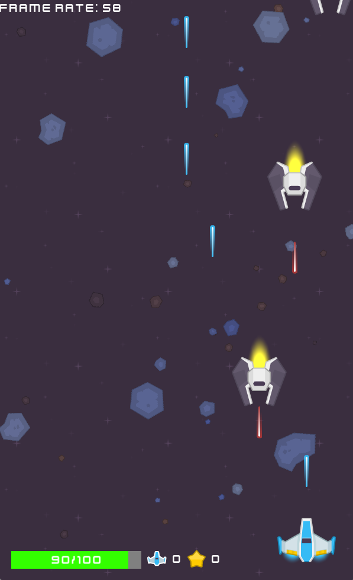
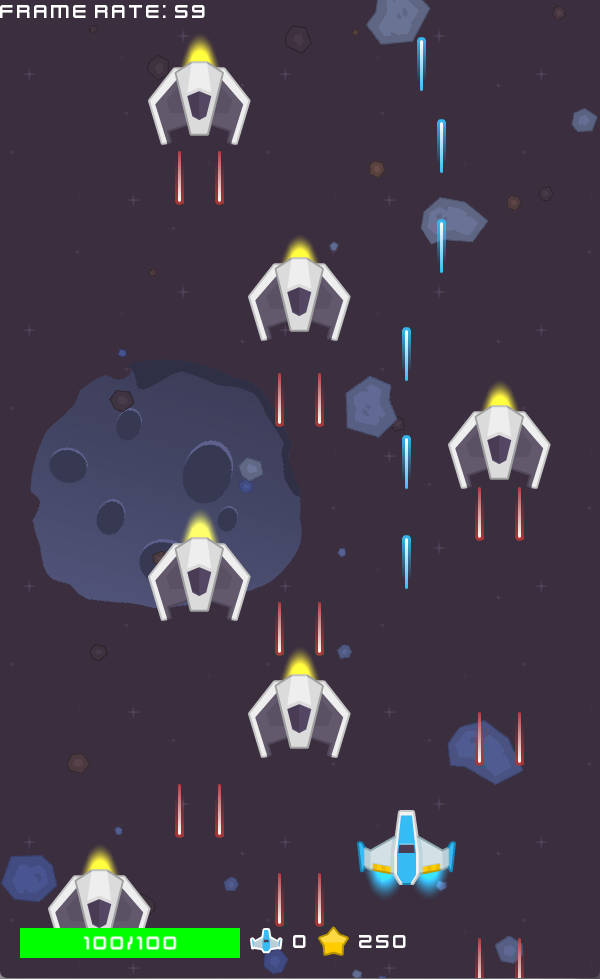

# Light Years


A high-performance 2D space shooter built from scratch with a custom engine architecture, featuring dynamic lighting, advanced physics, and procedurally managed enemy waves.

---

## Introduction

**Light Years** is a modern C++17 space shooter game built from the ground up with a custom game engine. The player commands a hero spaceship against waves of enemy ships through procedurally managed stages, culminating in a boss battle and an infinite survival mode.

**Project Origin & Evolution:**
This project initially started as part of the **[Learn C++ and Make a Game from Scratch](https://www.udemy.com/course/complete-game-development-series-04-making-a-game-with-c/learn/lecture/40817092#overview)** course on Udemy. It has since been significantly expanded with custom systems including shaders, sound system, parallax scrolling, multi-phase boss AI, and more.

You can download the game from this repository (see `LightYears.7z`) or from [itch.io](https://parsik4.itch.io/light-years).

---

## Security & Antivirus Verification

**Important Notice:** This is an **unsigned executable** from an independent developer. Windows Defender may show a SmartScreen warning.

**VirusTotal Scan Results:**
- **Verified Clean** by 60+ antivirus engines
- [View Full VirusTotal Report](https://www.virustotal.com/gui/file/c860514a1a724c28256f4c11d9118023c3ee707371953c9baf50399e572bde64/detection)

*Note: Any generic "suspicious" flags are **false positives** common to unsigned C++ games.*

---

## Screenshots

<p align="center">
  
  
</p>

---

## Key Features

### Gameplay
- **5 Enemy Types** with unique AI behaviors:
  - **Vanguard** — Straight dive attack
  - **TwinBlade** — Dual-weapon dive attack
  - **Hexagon** — Multi-directional fire
  - **UFO** — Bouncing movement with screen-edge reflection
  - **Boss** — Multi-phase fight with escalating weapons
- **Elite Variants** — Stronger versions of standard enemies (higher HP, damage, score)
- **Ability-Based Combat** — Slot-based ability system (PrimaryWeapon + active skills via AbilityController)
- **Shield System** — Activatable shield with HP absorption, cooldown, and HUD integration
- **Arena Combat Mode** — Free 2D thrust/drift movement with camera follow (ThrustDrift mode)
- **Infinite Survival Mode** — Endless waves with escalating difficulty and formation patterns
- **Power-up System** — Health (+25 HP), Shield, Extra Lives
- **Weighted Loot Drops** — Each enemy type has unique reward probabilities
- **Scoring System** — Points per enemy type (Vanguard: 10, TwinBlade: 20, Hexagon: 30, UFO: 40, Boss: 500)

### Technical
- **Dynamic Lighting** — GLSL point light shaders with radial falloff, engine glow, projectile trails
- **Parallax Scrolling** — Multi-layer backgrounds with planets and meteors at different depth speeds
- **Advanced Audio System** — Music cross-fading, intro+loop pattern (boss theme), sound pooling, time scaling
- **Performance-Aware VFX** — Explosion particles auto-throttle based on active actor count
- **Optimized Rendering** — Lazy sorting (97% fewer sort calls), depth-sorted actors
- **Box2D 3.x Physics** — Circle/polygon collision shapes with team-based filtering

---

## Project Structure

```
LightYears/
├── LightYearsEngine/              # Core engine (reusable framework)
│   ├── framework/                 # Application, World, Actor, Physics, Audio, Assets
│   ├── gameplay/                  # Game stage management (wave system)
│   ├── widget/                    # UI framework (HUD, Buttons, Gauges, Text)
│   └── VFX/                      # Particle system
│
├── LightYearsGame/                # Game-specific logic
│   ├── player/                    # Player ship, input, rewards, lives, shield, respawn
│   ├── enemy/                     # Enemy AI, wave stages, boss
│   ├── weapon/                    # Bullet actor (projectile runtime)
│   ├── gameplay/                  # Ability controllers, health, attributes (logic layer)
│   │   └── ability/               # AbilitySystem, AbilityController + controllers/
│   ├── level/                     # Level management, arena, main menu
│   ├── environment/               # Asteroids
│   ├── VFX/                       # Explosions
│   ├── widget/                    # Game HUD, menus
│   ├── presentation/hud/         # HUD controllers + view models (MVC layer)
│   ├── gameConfigs/               # Pure-data schemas + static config catalog
│   └── assets/                    # Textures, audio, shaders
│       └── SpaceShooterRedux/     # Kenney.nl asset pack (CC0)
│           ├── PNG/               # Ship, laser, planet, meteor textures
│           ├── Musics/            # 5 OGG music tracks
│           ├── Shaders/           # 3 GLSL fragment shaders
│           └── Bonus/             # Fonts and SFX
```

---

## Build Instructions

### Prerequisites

| Requirement | Version | Notes |
|------------|---------|-------|
| **CMake** | 3.31.6+ | Build system |
| **C++ Compiler** | C++17 | MSVC 2022 / GCC 11+ / Clang 14+ |
| **Git** | Latest | For dependency fetching |
| **Windows** | 10/11 | Primary platform |

### Dependencies (Auto-Fetched by CMake)

| Library | Version | Purpose |
|---------|---------|---------|
| **SFML** | 3.0.1 | Graphics, Audio, Window, System |
| **Box2D** | 3.1.1 | Physics Engine |
| **FreeType** | (via SFML) | Font Rendering |
| **FLAC/Vorbis/Ogg** | (via SFML) | Audio Codecs |

> **Note:** All dependencies are automatically downloaded and built via CMake `FetchContent`. No manual installation required.

### Build Steps

1. **Clone the repository:**
   ```bash
   git clone https://github.com/MuhammetKarakass/LightYears.git
   cd LightYears
   ```

2. **Configure with CMake:**
   ```bash
   cmake -S . -B build -G "Visual Studio 17 2022"
   ```

3. **Build (Release recommended for performance):**
   ```bash
   cmake --build build --config Release
   ```

4. **Run the game:**
   ```bash
   cd build\LightYearsGame\Release
   .\LightYearsGame.exe
   ```

### CMake Options

```cmake
# MSVC Release optimizations (already configured)
/O2    # Maximize speed
/Ob2   # Aggressive inline
/Oi    # Intrinsic functions
/Ot    # Favor fast code
/GL    # Whole program optimization
/LTCG  # Link-time code generation

# GCC/Clang Release optimizations
-O3 -march=native
```

---

## Controls

| Key | Action |
|-----|--------|
| **W / ↑** | Move Up |
| **A / ←** | Move Left |
| **S / ↓** | Move Down |
| **D / →** | Move Right |
| **Space** | Shoot |
| **ESC** | Pause Menu |

---

## Current Features

- ✅ Custom game engine with actor lifecycle management
- ✅ 5 enemy types + elite variants with unique AI behaviors
- ✅ Multi-phase boss fight with health-based stage transitions
- ✅ Slot-based ability system (PrimaryWeapon + Shield controllers)
- ✅ Arena combat mode with free 2D thrust/drift movement
- ✅ Shield ability with HP absorption, cooldown, and HUD integration
- ✅ Infinite survival mode with escalating difficulty
- ✅ Dynamic GLSL lighting (engine glow, projectile trails, flicker)
- ✅ Multi-layer parallax scrolling with planets and meteors
- ✅ Advanced audio (cross-fading, intro+loop, sound pooling, time scaling)
- ✅ Data-driven game design (pure-data configs in gameConfigs/, logic in gameplay/)
- ✅ Box2D 3.x physics with team-based collision filtering
- ✅ Performance-aware particle throttling
- ✅ Full UI system (main menu, pause, game over, in-game HUD)
- ✅ MVC HUD architecture (HUDController → SkillUIController / GameplayWarningHUDController)
- ✅ Power-up system with weighted loot tables
- ✅ Asteroid obstacles with recursive splitting

## Planned Features

<!-- Add your planned features here -->

---

## System Requirements

| Component | Requirement |
|-----------|------------|
| **OS** | Windows 10/11 (64-bit) |
| **CPU** | Dual-core 2.0 GHz+ |
| **RAM** | 2 GB |
| **GPU** | OpenGL 3.3+ support |
| **Storage** | 500 MB |

Users may need: [Visual C++ Redistributable 2022](https://aka.ms/vs/17/release/vc_redist.x64.exe)

---

## Known Issues

- 🐛 **Console Window** appears in Debug mode (intentional for logging)
- 🐛 **No gamepad support** — keyboard only

---

## Contributing

This is a **portfolio project** not accepting external contributions. However, feel free to:
- Fork for learning purposes
- Report bugs via [GitHub Issues](https://github.com/MuhammetKarakass/LightYears/issues)

---

## License

**Educational & Portfolio Use Only**

This project is for demonstration purposes. Game assets (SpaceShooterRedux pack) are from [Kenney.nl](https://kenney.nl) under CC0 license.

---

## Developer

**Muhammet Ali Karakaş**
- 📧 Email: m.karakas.buisness@gmail.com
- 💼 LinkedIn: [Muhammet Ali Karakaş](https://www.linkedin.com/in/muhammet-ali-karakas/)

---

## Acknowledgments

- **SFML Team** — Multimedia library foundation
- **Box2D** (Erin Catto) — Physics engine
- **Kenney.nl** — Space shooter art pack (CC0)
