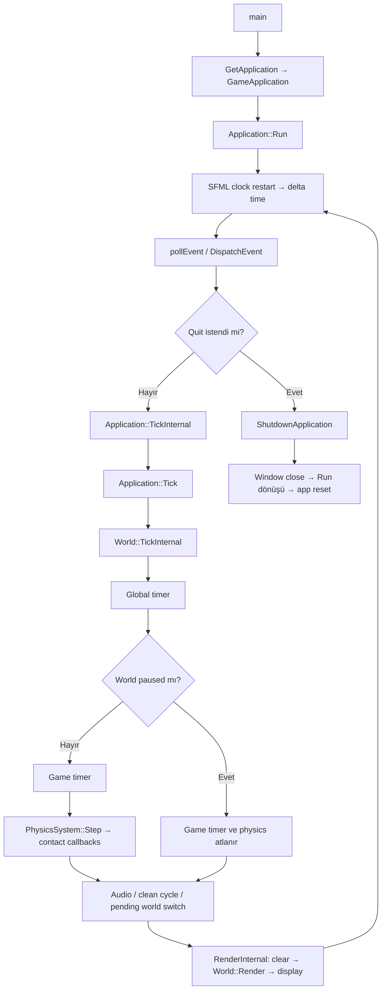

# Game Loop

## Doğrulanmış frame sırası



Input event’leri frame başında World/HUD’a gönderilir. Ardından actor/world update’i, timer’lar ve collision çalışır. Collision callback’leri `PhysicsSystem::Step` içinde world tick bittikten sonra gelir. Render son aşamadır.

## Kritik gerçek kod

Dosya: `LightYearsEngine/src/EntryPoint.cpp`  
Sınıf veya namespace: global  
Fonksiyon: `main`  
Görevi: Uygulamayı sahiplenen `unique_ptr` oluşturmak ve loop’u başlatmak.

```cpp
std::unique_ptr<ly::Application> app{ GetApplication() };
if (!app)
{
	std::cerr << "Failed to create application." << std::endl;
	return 1;
}

app->Run();
app.reset();
std::quick_exit(0);
```

Dosya: `LightYearsEngine/src/framework/Application.cpp`  
Sınıf veya namespace: `ly::Application`  
Fonksiyon: `Run`  
Görevi: Delta time üretmek, event’leri işlemek, update ve render sırasını yürütmek.

```cpp
while (mWindow.isOpen() && !mShouldQuit)
{
	sf::Time deltaTime = mTickClock.restart();
	float dt = deltaTime.asSeconds();
	
	while (const std::optional event = mWindow.pollEvent())
	{
		if (event->is<sf::Event::Closed>())
		{
			QuitApplication();
		}
		else 
		{
			DispatchEvent(event);
		}

		if (mQuitRequested)
		{
			break;
		}
	}

	if (mQuitRequested)
	{
		ShutdownApplication();
	}

	if (!mWindow.isOpen() || mShouldQuit)
	{
		break;
	}
	
	TickInternal(dt);
	if (mQuitRequested)
	{
		ShutdownApplication();
		break;
	}

	RenderInternal();
}
```

Dosya: `LightYearsEngine/src/framework/Application.cpp`  
Sınıf veya namespace: `ly::Application`  
Fonksiyon: `TickInternal`  
Görevi: Application, World, timer, physics, audio, temizlik ve world geçişini sıraya koymak. World değiştirme bölümü bu parçada çıkarılmıştır.

```cpp
Tick(deltaTime);

if(mCurrentWorld)
{
	mCurrentWorld->TickInternal(deltaTime);
}

TimerManager::GetGlobalTimerManager().UpdateTimer(deltaTime);

bool isPaused = mCurrentWorld && mCurrentWorld->IsPaused();

if (!isPaused)
{
	TimerManager::GetGameTimerManager().UpdateTimer(deltaTime);
	PhysicsSystem::Get().Step(deltaTime);
}

AudioManager::GetAudioManager().Update(deltaTime);
```

Dosya: `LightYearsEngine/src/framework/PhysicsSystem.cpp`  
Sınıf veya namespace: `ly::PhysicsSystem`  
Fonksiyon: `Step`  
Görevi: Bekleyen body silmelerini uygulamak, Box2D adımını ve collision event’lerini çalıştırmak.

```cpp
if (mPhysicsWorld.index1 != 0)
{
	ProcessPendingRemoveListeners();
	b2World_Step(mPhysicsWorld, deltaTime, 4);

	ProcessContactEvents();
}
```

Dosya: `LightYearsEngine/src/framework/Application.cpp`  
Sınıf veya namespace: `ly::Application`  
Fonksiyon: `RenderInternal`  
Görevi: Frame buffer’ını temizlemek, world’ü çizmek ve frame’i sunmak.

```cpp
mWindow.clear();  
Render();         
mWindow.display();
```

Dosya: `LightYearsEngine/src/framework/Application.cpp`  
Sınıf veya namespace: `ly::Application`  
Fonksiyon: `ShutdownApplication`  
Görevi: Normal kapanışta servisleri ve world’leri belirli sırayla bırakmak.

```cpp
AudioManager::ShutdownAudioManager();
TimerManager::ShutdownTimerManagers();
mPendingWorld.reset();
mCurrentWorld.reset();
PhysicsSystem::ShutdownPhysicsSystem();
ShaderManager::ShutdownShaderManager();
AssetManager::ShutdownAssetManager();
mWindow.close();
mQuitRequested = false;
mShouldQuit = true;
```

## Erken çıkışlar ve frame sonu

- Close event’i `QuitApplication` ile yalnızca `mQuitRequested` işaretler; event loop kırılır ve `ShutdownApplication` çalışır.
- Tick sırasında quit istenirse render yapılmadan kapanılır.
- Pending-destroy actor’lar `World::CleanCycle` ile world tick sonunda çıkarılır; collision sırasında destroy edilen actor ise bu temizleme noktasını geçtiği için bir sonraki world tick’inde koleksiyondan çıkar.
- Render, pending-destroy actor’ları filtreler.

## Test ve doğrulama

### Mevcut testler

`LightYearsGame/tests/GasLiteCoreTests.cpp`, `World::TickInternal` çağrıları üzerinden pending spawn promotion, actor update ve gameplay actor cleanup davranışını dolaylı olarak kullanır. Örneğin rocket ve telegraph actor’larının sonraki tick’te koleksiyondan çıktığını denetleyen kontroller vardır.

### Doğrudan test edilmeyen davranışlar

`Application::Run` event/update/render sırası, SFML close event’i, pause sırasında global/game timer ayrımı ve shutdown servis sırası için izole test bulunamadı.

### Manuel doğrulama gereken noktalar

Gerçek pencere event’leri, render sunumu, Box2D contact sırası ve platforma bağlı kapanış davranışı.

### Önerilen fakat henüz bulunmayan testler

- Enstrümante edilmiş Application/World ile frame çağrı sırası testi.
- Pause açıkken global timer’ın ilerleyip game timer/physics’in durduğunu doğrulayan test.
- Tick içinde quit talebinin render’ı atladığını doğrulayan test.

## Kod Okuma Sırası

1. `LightYearsEngine/src/EntryPoint.cpp` — gerçek executable başlangıcı.
2. `LightYearsGame/src/gameFramework/GameApplication.cpp` — somut uygulama ve ilk world.
3. `LightYearsEngine/src/framework/Application.cpp` — ana loop ve frame sırası.
4. `LightYearsEngine/src/framework/World.cpp` — actor/world update sırası.
5. `LightYearsEngine/src/framework/PhysicsSystem.cpp` — collision adımının frame’e bağlandığı yer.

