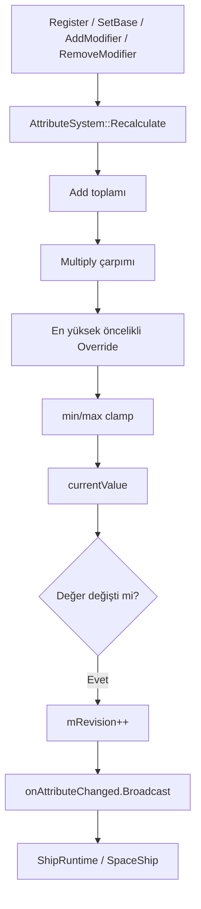

# Attribute System

## Sistem özeti

`sas::AttributeSystem`, tag ile adreslenen `GameplayAttribute` değerlerini, kalıcı base değişikliklerini ve handle ile sökülebilen runtime modifier'ları tutar. Normal çözüm `(base + Add toplamı) × Multiply çarpımı → en yüksek öncelikli Override → min/max clamp` sırasındadır. Değer değişince revision artırılır ve delegate yayınlanır.

## Uygulama durumu

**Implemented ve doğrulandı.** Register/read/base
mutation, geçici modifier add/remove, yeniden hesaplama, revision ve
change/registration/clear bildirimleri vardır. Çekirdek statik
`SpaceAbilitySystem` target'ına taşınmış, public tipler `sas` namespace'ine
alınmıştır. Algoritma değiştirilmemiştir. Tam Debug build ve
`LightYearsGasLiteCore`/`LightYearsEngineLifetime` için 2/2 CTest sonucu
tarihsel kayıttır; bu docs-only denetiminde güncel build/test çalıştırılmadı.

Projede ayrı `finalValue` alanı yoktur. `baseValue` kalıcı başlangıç/değişim değeridir; `currentValue`, modifier ve clamp uygulanmış eager **resolved/final cache**'idir. Definition-local `GameplayAttributeList` değerleri ise aynı struct'ı kullansa da owner `AttributeSystem` storage'ı olmak zorunda değildir.

## Sorumluluklar

- Attribute storage, base/current değer ve min/max sınırları.
- Kalıcı base mutation ile handle tabanlı geçici modifier lifecycle.
- Eager resolved-value hesaplama, revision ve delegate notification.

## Sorumlu olmadığı işler

- Effect duration/stack, ship-derived formül, rating eğrisi veya ability/weapon scaling sırasının domain kararı.
- Owner/ship/common ID kataloğu; bu content
  `LightYearsGame/include/gameplay/attributes/AttributeIds.h` içindedir.
- Attribute'ı tek tek kaldırmak; public remove API yoktur, yalnız modifier removal ve tüm sistemi `Clear` vardır.

## Ana veri tipleri

| Sınıf/veri tipi | Dosya | Sorumluluk | Sahibi | Yaşam süresi |
|---|---|---|---|---|
| `GameplayAttribute` | `GameplayAttribute.h` | id, base/current ve min/max | Entry, definition/spec veya local list | Container ömrü |
| `AttributeModifier` | `AttributeSystem.h` | operation/magnitude/priority | Entry veya definition/spec | Container ömrü |
| `AttributeModifierHandle` | `AttributeSystem.h` | Geçici modifier token'ı | Caller ve active effect kopyası | Modifier kaldırılana kadar anlamlı |
| `GameplayAttributeEntry` | `AttributeSystem.h` | Attribute + handle→modifier map | `AttributeSystem` | Sistem veya clear'a kadar |
| `AttributeScalingRule` | `AttributeSystem.h` | Cross-attribute scaling verisi | Ability/weapon definition | Definition ömrü |
| `AttributeSystem` | `AttributeSystem.h/.cpp` | Mutable owner-local storage/resolver | `CombatRuntime` veya `ShipRuntime` | Owner runtime ömrü |

## Giriş noktaları

- `RegisterAttribute`: attribute ekler veya var olan kaydı değiştirir.
- `GetBaseValue` / `GetCurrentValue`: okunmuş base veya resolved değer.
- `SetBaseValue` / `ApplyBaseModifier`: kalıcı base mutasyonu.
- `AddModifier` / `RemoveModifier`: handle tabanlı geçici modifier yaşam döngüsü.
- `GetSequentialReductionMultiplier`: reduction değerlerini sıralı çarpar.
- `Clear`: tüm attribute ve modifier storage'ını temizler.

### Okuma, cache ve lifecycle

- `GetCurrentValue` mevcut `currentValue` alanını hash lookup ile okur; her okumada modifier taramaz.
- Cache eager'dır: register/base/modifier mutation hemen `Recalculate` çağırır.
- Ayrı dirty flag yoktur. `mRevision`, dış resolved cache'ler için epoch görevi görür.
- Eksik attribute: base getter `0`, current getter caller'ın `fallback` değerini döndürür.
- Sistem kendi başına tick veya timer kullanmaz.

## Bağımlılıklar

### Bu sistemin kullandığı sistemler

- [[Gameplay Tag System]]: attribute kimlikleri.
- `Delegate`: değişim, kayıt ve clear bildirimleri.
- Standard library: clamp ve container'lar.

### Bu sistemi kullanan sistemler

- `CombatRuntime` owner attribute sistemini sahiplenir.
- `ShipRuntime`, owner değişimlerini dinler ve ship türevlerini yeniden hesaplar.
- `SpaceShip`, owner/ship değişimlerini component state'ine yansıtır.
- [[Gameplay Effect System]], süreli effect modifier'larını handle ile ekleyip kaldırır; instant effect base değeri değiştirir.
- Ability/weapon/attachment çözümleyicileri helper ve revision okur; ayrıntıları bu kapsamda değildir.

## Çağrı ve veri akışı



## Kritik gerçek kod

Dosya: `SpaceAbilitySystem/include/attributes/GameplayAttribute.h`  
Sınıf veya namespace: `sas::GameplayAttribute`  
Fonksiyon: veri tanımı  
Görevi: Attribute'in base/current ve clamp sınırlarını taşır.

```cpp
	struct GameplayAttribute
	{
		GameplayTag id;
		float baseValue = 0.f;
		float currentValue = 0.f;
		float minValue = 0.f;
		float maxValue = std::numeric_limits<float>::max();
```

Dosya: `SpaceAbilitySystem/src/attributes/AttributeSystem.cpp`  
Sınıf veya namespace: `sas::AttributeSystem`  
Fonksiyon: `AddModifier`  
Görevi: Modifier için handle üretir, iki yönlü lookup kaydeder ve attribute'i yeniden çözer.

```cpp
		const unsigned int handleId = mNextHandleId++;
		mAttributes[modifier.attributeId].modifiers[handleId] = modifier;
		mHandleToAttribute[handleId] = modifier.attributeId;
		Recalculate(modifier.attributeId);
		return AttributeModifierHandle{ handleId };
```

Dosya: `SpaceAbilitySystem/src/attributes/AttributeSystem.cpp`  
Sınıf veya namespace: `sas::AttributeSystem`  
Fonksiyon: `Recalculate`  
Görevi: Normal operation sırasını uygular ve clamp eder.

```cpp
		value = (value + additive) * multiplicative;
		if (hasOverride)
		{
			value = overrideValue;
		}
		value = std::clamp(value, entry.attribute.minValue, entry.attribute.maxValue);
```

Dosya: `SpaceAbilitySystem/src/attributes/AttributeSystem.cpp`  
Sınıf veya namespace: `sas::AttributeSystem`  
Fonksiyon: `Recalculate`  
Görevi: Gerçek değer değişiminde cache revision ve delegate yayınını ilerletir.

```cpp
		const float previousValue = entry.attribute.currentValue;
		entry.attribute.currentValue = value;
		if (previousValue != value)
		{
			++mRevision;
			onAttributeChanged.Broadcast(id, previousValue, value);
		}
```

Dosya: `SpaceAbilitySystem/src/attributes/AttributeSystem.cpp`  
Sınıf veya namespace: `sas::AttributeSystem`  
Fonksiyon: `GetSequentialReductionMultiplier`  
Görevi: Bağımsız reduction kaynaklarını doğrudan toplamadan çarpımsal hale getirir.

```cpp
		auto reductionToMultiplier = [](float reduction)
		{
			return 1.f - std::clamp(reduction, -0.95f, 0.95f);
		};
```

## Kod okuma sırası

1. `GameplayAttribute.h`
2. `AttributeSystem.h`
3. `AttributeSystem.cpp::RegisterAttribute`
4. `AttributeSystem.cpp::AddModifier` ve `RemoveModifier`
5. `AttributeSystem.cpp::Recalculate`
6. `AttributeMath.h`
7. `CombatRuntime.cpp` ve `ShipRuntime.cpp` bağlantıları

## Testler

### Mevcut test dosyası ve doğrudan kapsam

- Tag-count testi attribute testinden hemen önce çalışır.
- `AttackPower`: base 10 + Add 5, sonra ×2 = 30.
- Multiply modifier kaldırıldıktan ve base'e +5 uygulandıktan sonra resolved değer 20.
- İki ayrı `0.1` reduction kaynağı `0.9 × 0.9 = 0.81` üretir.
- Armor 50'nin `%50` reduction üretmesi ve crit/haste/luck eğrilerinin monoton/asimptotik kalması test edilir.

### Dolaylı kapsam

- Ship-derived değerler, progression, ability cache ve effect modifier cleanup geniş integration testinde kullanılır.

### Test edilmeyen / manuel

- Delegate call count, unchanged-value sessizliği, revision adımı, reentrancy ve clear callback'i doğrudan test edilmez.
- Override priority/tie, NaN/Inf ve handle overflow test edilmez.

### Önerilen fakat henüz uygulanmamış

- Küçük bir AttributeSystem test fixture'ında notification/revision matrisi.
- Override priority ve invalid float tablosu.

- Taşıma öncesi Debug ve Release `LightYearsGasLiteTests.exe`: exit code `0`.
  2026-07-29 SAS Attribute taşıması sonrasında test henüz yeniden çalıştırılmadı.

## Boşluklar ve riskler

### Koddan doğrulanan eksikler

- `RegisterAttribute` var olan entry'yi değiştirirken modifier map'ini korur.
- Eşit priority Override için unordered map dolaşımında son görülen değer kazanır; deterministik içerik sırası kontratı yoktur.
- Float değişimi exact `!=` ile bildirilir; epsilon yoktur.
- `RegisterAttribute`, `Recalculate` değer değiştirirse revision'ı orada artırır ve sonra ayrıca koşulsuz artırır.
- `onAttributeRegistered` ve `onAttributesCleared` için repo içinde production subscriber bulunamadı.

### İncelenmesi gereken olası geliştirmeler

- Handle ID taşması ve eşit öncelikli Override çakışması için doğrudan test bulunamadı.
- Callback içinde aynı attribute'i tekrar değiştiren zincirlerin reentrancy politikası doğrulanamadı.
- `CalculateModifiedAttributeValue` ile `AttributeSystem::Recalculate` aynı algoritmayı ayrı uygular; gelecekte drift riski vardır.

## Kaynak doğrulaması

- Commit tabanı: `b2e24c11d157c64b89bd1cf47c1390bf72784056`
- İncelenen durum: dirty worktree
- Bilgi grafiği: `AttributeSystem`, tüm public mutation/read girişleri ve `Recalculate` çağıran beş production yol doğrulandı.
- Literal/reference araması: delegate subscriber'ları `ShipRuntime` ve `SpaceShip`; revision tüketicileri `FireWeaponActionRuntime` ve `AbilityActionAttributeResolver`.
- Test: Taşıma öncesi Debug ve Release başarılıydı; 2026-07-29 değişikliği
  kullanıcı kararı gereği henüz doğrulanmadı.
- Worktree'de `GameplayAttribute.h`, movement/effect entegrasyonları ve test değişiklikleri commitlenmemiştir.
