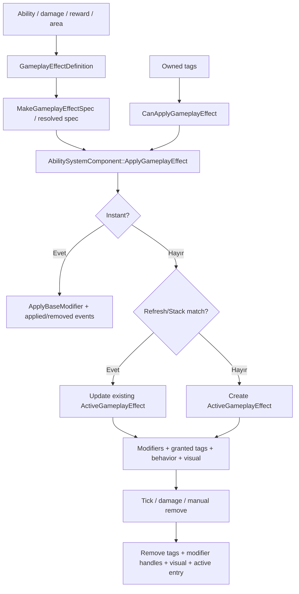

# Gameplay Effect System

## 20 Eylül 2026 kaynak kontrolü

Güncel generic apply/stack/refresh yaşam döngüsü SpaceAbilitySystem/include/effects/GameplayEffectRuntimeSystem.h içindedir. Oyun facade'ı SpaceAbilitySystem/include/AbilitySystemComponent.h, callback/presentation bağlantısı LightYearsGame/src/gameplay/combat/CombatRuntime.cpp üzerinden yapılır. Reentrancy için handle yeniden kontrolü olan dallar var; bu inceleme bütün callback kombinasyonlarını doğrulamadı.

Bu ek kaynak incelemesidir; build/test çalıştırılmadı. Aşağıdaki eski örnekler tarihsel inceleme kapsamını taşır; bu güncelleme ile çelişen ayrıntılar güncel davranış kabul edilmemeli.


## Sistem özeti

GAS-Lite effect çekirdeği üç katmanı ayırır: shipped/default içerik `sas::GameplayEffectDefinition`, kaynak başına çözümlenmiş generic gövde `sas::GameplayEffectSpec`, hedefe ait mutable durum `sas::GameplayEffectRuntimeState`. Oyun tarafındaki behavior/runtime adapter'ları bunları Actor/context/visual bağlarıyla genişletir. `sas::GameplayEffectLifecycleOrchestrator` instant/active, source-scope stacking, refresh/stack ve duration expiry kararlarını verir. `sas::GameplayEffectRuntimeSystem` bu kararları typed binding ve callback'ler üzerinden uygular; `sas::AbilitySystemComponent` oyun facade'ıdır.

## Uygulama durumu

**Implemented in the verified dirty worktree.** Instant, Duration ve Infinite; None, RefreshDuration ve Stack; manual remove, duration expiry, source-scope eşleşmesi, modifier/tag cleanup, snapshots ve delegates kodda vardır.

Önemli durum notu: `GameplayEffectSpec.h`, content/validation/area uygulama dosyaları ve ilgili birçok entegrasyon worktree'de untracked veya modified durumdadır. Bu yüzden commit hash tek başına aşağıdaki güncel mimariyi temsil etmez.

## Sorumluluklar

- Apply gate, duration/stack policy ve active state sahipliği.
- SAS binding katmanı üzerinden modifier/granted-tag ekleme ile ortak cleanup.
- Behavior hook, effect snapshot ve lifecycle delegate'leri.

## Sorumlu olmadığı işler

- İçerik kaydı/validation, effect-family özel davranış ve visual çizimi.
- `TimerManager` tabanlı süre yönetimi; core duration `CombatRuntime::Tick` üzerinden azalır.
- Birinci sınıf periodic policy; per-frame/periodic davranış gerekiyorsa behavior `Tick` hook'u ve runtime attribute/context bunu uygular.

## Ana veri tipleri

| Sınıf/veri tipi | Dosya | Sorumluluk | Sahibi | Yaşam süresi |
|---|---|---|---|---|
| `sas::GameplayEffectDefinition` | `effects/GameplayEffectDefinition.h` | İçerik policy/default payload | Content catalog veya caller value | Content/program ömrü |
| `sas::GameplayEffectSpec` | `effects/GameplayEffectSpec.h` | Generic resolved payload gövdesi | Producer, sonra active effect | Apply/active effect ömrü |
| `LightYearsEffectBehaviorRuntime` | `LightYearsGame/include/gameplay/effects/LightYearsEffectBehaviorRuntime.h` | Game behavior hooks ve runtime callback bağları | Game ability/combat adapter | Owner runtime ömrü |
| `sas::GameplayEffectHandle` | `effects/GameplayEffectHandle.h` | Active kimliği | Caller + effect system | Removal/clear'a kadar anlamlı |
| `sas::GameplayEffectRuntimeState` | `effects/GameplayEffectRuntimeState.h` | Duration/stack/modifier-handle/runtime-attribute state | Game active effect | Expiry/removal/clear'a kadar |
| `sas::GameplayEffectCollection` | `effects/GameplayEffectCollection.h` | Active value storage + handle allocation/lookup/index erase | `sas::GameplayEffectRuntimeSystem` | Owner runtime ömrü |
| `sas::ActiveGameplayEffect` | `SpaceAbilitySystem/include/effects/ActiveGameplayEffect.h` | SAS state + spec/source/context/visual uzantısı | SAS collection | Expiry/removal/clear'a kadar |
| `sas::GameplayEffectRuntimeSnapshot` | `effects/GameplayEffectRuntimeSnapshot.h` | UI/inspection kopyası | Snapshot caller | Value lifetime |

## Giriş noktaları

- `AbilitySystemComponent::ApplyGameplayEffect(definition/spec, context)`: facade üzerinden tek kanonik uygulama yoluna delegasyon.
- `AbilitySystemComponent::CanApplyGameplayEffect`: owned tag required/blocked kontrolü.
- `RefreshGameplayEffectDuration`: yalnızca Duration effect'in sayacını resetler.
- `AbilitySystemComponent::Tick`: behavior hook, duration decrement ve expiry cleanup.
- `RemoveGameplayEffect` / `RemoveGameplayEffectsIf`: handle/predicate ile normal cleanup.
- `Clear`: tüm active effect'leri normal removal yolundan geçirir.
- `ProcessGameplayEffectEvent`: active effect behavior'larını faza göre çağırır.
- `FindGameplayEffect`, `FindGameplayEffectById`, `BuildGameplayEffectSnapshots`: read yüzeyi.

### Oluşturma, target, timer ve lifecycle

- `CombatRuntime` `mAbilitySystemComponent` effect facade'ını value member olarak kurar; hedef owner bilgisi game component'ta tutulur.
- Source `Actor*`, source scope `const void*` olarak active state'e kopyalanır; ikisi de non-owning'dir.
- Typed `runtimeContext` `std::shared_ptr` ile active effect tarafından sahiplenilebilir.
- Duration için `TimerManager` yoktur; `CombatRuntime::Tick` effect sistemini ability'den önce tick eder.
- Owner `CombatRuntime::Clear` çağırırsa normal removal sırası işler. Owner'ın `Clear` olmadan doğrudan yok edilmesindeki visual/callback sonucu bütünüyle doğrulanamadı.

### Duration ve duplicate/stack davranışı

| Policy | Gerçek davranış |
|---|---|
| `Instant` | Modifier'ı base'e kalıcı uygular; active kayıt oluşturmaz |
| `Duration` | Tick ile `remainingDuration` azalır; sıfırda ortak cleanup |
| `Infinite` | Süre azalmaz; behavior/manual remove/clear ile biter |
| `None` | Aynı effect ID tekrar uygulanırsa ayrı active kayıt oluşturabilir |
| `RefreshDuration` | Eşleşen active effect'in spec/context/modifier/tag/visual state'ini rebuild eder |
| `Stack` | Limit altındaysa stack count ve yeni modifier handle'ları ekler |

Ayrı `Replace` veya duplicate-reject policy enum'u yoktur. Apply required/blocked tag, stack ve duration ön koşulları başarısızsa invalid handle döndürür. Shipped definition validation content-registration aşamasındadır; kanonik `ApplyGameplayEffect` her çağrıda tam behavior/visual schema validation'ı yapmaz.

## Bağımlılıklar

### Bu sistemin kullandığı sistemler

- [[Attribute System]]: instant base mutation ve süreli modifier handle'ları.
- [[Gameplay Tag System]]: application gate ve granted tag ownership.
- `GameplayEffectBehavior`: effect-family özel initialize/refresh/stack/tick/damage hook dispatch.
- `sas::GameplayEffectBehaviorRegistry`: typed hook value depolama ve lookup.
- `sas::GameplayEffectBindings`: application gate, modifier ve tag binding/cleanup.
- Effect visual registry: yalnız presentation bağlantısı; gameplay state'in sahibi değildir.

### Bu sistemi kullanan sistemler

- `CombatRuntime` effect sistemini owner, attribute ve tag referanslarıyla kurar; her frame ability'den önce tick eder.
- Damage type, ability action, reward ve area applicator `ApplyGameplayEffect` çağırır.
- Movement, shield/barrier ve diğer sistemler effect modifier/behavior çıktısını tüketebilir; ayrıntıları bu notun dışındadır.

## Çağrı ve veri akışı



## Kritik gerçek kod

Dosya: `SpaceAbilitySystem/include/effects/GameplayEffectDefinition.h`  
Sınıf veya namespace: `sas::GameplayEffectDefinition`  
Fonksiyon: veri tanımı  
Görevi: İçerik politikasını ve varsayılan effect payload'unu taşır.

```cpp
	struct GameplayEffectDefinition
	{
		std::string effectId;
		GameplayEffectBehaviorKey behaviorKey;
		GameplayEffectDurationPolicy durationPolicy = GameplayEffectDurationPolicy::Instant;
		GameplayEffectStackingPolicy stackingPolicy = GameplayEffectStackingPolicy::None;
		float duration = 0.f;
		int maxStacks = 1;
		List<GameplayTag> grantedTags;
		List<AttributeModifier> modifiers;
```

Dosya: `SpaceAbilitySystem/include/effects/GameplayEffectSpec.h`  
Sınıf veya namespace: `sas`  
Fonksiyon: `MakeGameplayEffectSpec`  
Görevi: Definition'dan uygulama başına bağımsız değer kopyası üretir.

```cpp
		return GameplayEffectSpec{
			definition,
			definition.duration,
			definition.maxStacks,
			definition.modifiers,
			definition.attributes,
			{}
		};
```

Dosya: `SpaceAbilitySystem/include/effects/GameplayEffectRuntimeSystem.h`  
Sınıf veya namespace: `sas::GameplayEffectRuntimeSystem`  
Fonksiyon: `ApplyEffect`  
Görevi: Instant effect'i active list'e eklemeden base attribute'e uygular.

```cpp
		if (applicationKind == GameplayEffectApplicationKind::Instant)
		{
			ApplyInstantGameplayEffect(spec, mAttributes);
			NotifyApplied(newHandle);
			NotifyRemoved(newHandle);
			NotifyCollectionChanged();
			return newHandle;
		}
```

Dosya: `SpaceAbilitySystem/include/effects/GameplayEffectRuntimeSystem.h`  
Sınıf veya namespace: `sas::GameplayEffectRuntimeSystem`  
Fonksiyon: `ApplyEffect`  
Görevi: Yeni active effect'in runtime state ve sahipliklerini başlatır.

```cpp
		ActiveEffect& effect = mActiveEffects.Emplace(newHandle);
		effect.spec = spec;
		effect.Initialize(newHandle, spec.duration, spec.attributes);
		BindSource(effect, context);
		Initialize(effect);
		ApplyGameplayEffectModifiers(effect.spec, effect, mAttributes);
		GrantGameplayEffectTags(effect.spec.definition, mOwnedTags);
		NotifyActivated(effect);
```

Dosya: `SpaceAbilitySystem/include/effects/GameplayEffectRuntimeSystem.h`  
Sınıf veya namespace: `sas::GameplayEffectRuntimeSystem`  
Fonksiyon: `RemoveEffectAt`  
Görevi: Tüm removal nedenleri için tek cleanup sırasını uygular.

```cpp
		ActiveEffect* effect = mActiveEffects.At(index);
		if (!effect)
		{
			return false;
		}
		return RemoveEffectInternal(effect->handle);
```

## Kod okuma sırası

1. `EffectStructs.h`
2. `GameplayEffectSpec.h`
3. `GameplayEffectHandle.h`
4. `ActiveGameplayEffect.h`
5. `AbilitySystemComponent.h`
6. `AbilitySystemComponent.cpp::ApplyGameplayEffect`
7. `GameplayEffectRuntimeSystem.h::Tick` ve `RemoveEffectAt`
8. `CombatRuntime.cpp` sahiplik/tick bağlantısı

## Testler

### Mevcut test dosyası ve doğrudan kapsam

- Shipped effect catalog lookup ve validation.
- İki ayrı spec'in shared definition'ı değiştirmemesi.
- Bilinmeyen behavior/visual kayıtlarının reddedilmesi.
- Barrier initialize, damage, remove ve add-stack behavior'ı.
- Infinite regenerating barrier state'i.
- Gravity Anomaly duration refresh, source-scope, exit tail, movement modifier ve visual cleanup entegrasyonu.

### Dolaylı kapsam

- Instant effect ve duration/stack/cleanup yolları progression, barrier, status ve Gravity entegrasyonlarında çalışır.

### Test edilmeyen / manuel

- Core için izole Instant/Duration/Infinite × None/Refresh/Stack matrisi yoktur.
- Owner destruction without `Clear`, delegate reentrancy ve source pointer geçerliliği doğrudan test edilmez.
- Asset warning'leri nedeniyle presentation sonucu görsel olarak manuel değerlendirilmeyi gerektirir.

### Önerilen fakat henüz uygulanmamış

- Timer kullanmayan duration boundary (`0`, negatif, tam delta eşitliği) testi.
- Apply/remove callback'i içinde reentrant removal testi.

- Debug ve Release executable'ları exit code `0`.

## Boşluklar ve riskler

### Koddan doğrulanan eksikler

- `None`, aynı ID'deki active effect'i aramaz; her çağrı yeni active entry üretir.
- Refresh yolu eski granted tag, modifier ve visual'ı kaldırıp spec/context'i değiştirir ve yeniden kurar.
- Stack yolu her yeni stack'te `ApplyGameplayEffectModifiers` çağırır; her modifier için ayrı handle saklanır.
- Instant effect için applied ve removed event'leri aynı çağrı içinde ardışık yayınlanır.
- Active storage `List` içindedir; alınan `ActiveGameplayEffect*`, liste mutasyonundan sonra kalıcı pointer kontratı sunmaz.

### İncelenmesi gereken olası geliştirmeler

- Generic core için None/RefreshDuration/Stack politikalarının tamamını izole eden küçük birim testler bulunamadı; kapsam ağırlıkla feature entegrasyonlarından gelir.
- Sıfır/negatif Duration değerinin apply anında reddi core içinde yoktur; validation kaydına güvenilir.
- Delegate callback'lerinin active listeyi reentrant değiştirmesine ilişkin açık güvence doğrulanamadı.
- Worktree dirty olduğundan güncel mimarinin commitlenmiş CI sonucu doğrulanamadı.

## Kaynak doğrulaması

- Commit tabanı: `b2e24c11d157c64b89bd1cf47c1390bf72784056`
- İncelenen durum: dirty worktree
- Bilgi grafiği: `ApplyEffect` için production çağıranlar damage status, area applicator ve reward; `ApplyEffect` 42 outbound ilişkiyle hotspot olarak doğrulandı.
- `Tick` → behavior dispatch / expiry; `RemoveEffectAt` → tag/modifier/visual cleanup yolu doğrulandı.
- Test: mevcut Debug ve Release binary'leri başarılı; asset warning'leri gözlendi.
- Commit tabanı ile dirty worktree ayrımı frontmatter ve durum metninde korunmuştur.
