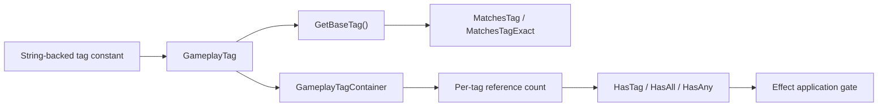

# Gameplay Tag System

## 20 Eylül 2026 kaynak kontrolü

Oyun şeması LightYearsGame/include/gameplay/tags/GameplayTagSchema.h; ortak tag kataloğu GameplayTags.h ve family leaf tag'leri tags/ability altında. AttributeIds tag kataloğunun yerine geçmez. ActionLock MovementInput/ExternalMovement ayrımı [[Movement]] içinde. Tüm string tüketicileri denetlenmedi.

Bu ek kaynak incelemesidir; build/test çalıştırılmadı. Aşağıdaki eski örnekler tarihsel inceleme kapsamını taşır; bu güncelleme ile çelişen ayrıntılar güncel davranış kabul edilmemeli.


## Sistem özeti

Light Years'ın gameplay tag sistemi merkezi bir registry veya sayısal tag tablosu değildir. `ly::GameplayTag`, bir `std::string` taşıyan değer tipidir; hiyerarşi nokta ayracıyla, runtime örnek indeksi ise sondaki `_N` ekiyle yorumlanır. `GameplayTagContainer` tag'leri referans sayacıyla tutar.

Oyun katmanında `GameplayTagSchema`, domain kökleri ile ortak action-lock tagleri
üzerinde merkezi bir sözleşme sağlar. Bu sözleşme feature-local leaf tagleri
registry'ye taşımaz; ability, weapon, effect, actor ve attachment aileleri kendi
leaf taglerini kendi kontratlarında tanımlar.

## Uygulama durumu

**Implemented.** Değer karşılaştırma, hash, parent eşleşmesi, runtime indeksini taban tag'e çevirme, counted add/remove ve `HasTag`/`HasAll`/`HasAny` yolları kodda ve çekirdek testte vardır.

“UE5 Style Type-Safe Tags (Auto-Indexed)” kaynak yorumu yanıltıcıdır: tag'ler compile-time type-safe enum değildir, otomatik bir registry tarafından intern edilmez ve yazım hataları derleme zamanında yakalanmaz.

## Sorumluluklar

- String-backed tag kimliği, equality, ordering ve hash sağlamak.
- Nokta ayracına göre parent-child eşleşmesi yapmak.
- `_N` runtime suffix'ini base tag sorgularında normalize etmek.
- Bir owner üzerindeki tag grant'lerini referans sayacıyla tutmak.
- Required/blocked query'lerine ortak container yüzeyi vermek.

## Sorumlu olmadığı işler

- Merkezi leaf-tag registration veya feature-local content sahipliği.
- Ability/effect/state davranışını çalıştırmak.
- Tag kategorilerinin schema bütünlüğünü build-time doğrulamak.

## Ana veri tipleri

| Sınıf/veri tipi | Dosya | Sorumluluk | Sahibi | Yaşam süresi |
|---|---|---|---|---|
| `GameplayTag` | `LightYearsEngine/include/framework/Core.h` | String kimliği ve eşleşme | Değerin bulunduğu nesne/container | Value lifetime |
| `GameplayTagHash` | `Core.h` | Hash adapter | Tip; runtime state yok | Program ömrü |
| `GameplayTagContainer` | `Core.h` | Counted owned-tag set | `CombatRuntime` | CombatRuntime ömrü |
| `OwnerAttributeIds` | `AttributeIds.h` | Owner attribute sabitleri | Static inline data | Program ömrü |
| `ShipAttributeIds` | `AttributeIds.h` | Ship attribute sabitleri | Static inline data | Program ömrü |
| `CommonAttributeIds` | `AttributeIds.h` | Definition-local ortak kimlikler | Static inline data | Program ömrü |
| `GameplayTagSchema` | `LightYearsGame/include/gameplay/tags/GameplayTagSchema.h` | Domain/biçim doğrulaması ve ortak action lock'lar | Static inline data | Program ömrü |

## Giriş noktaları

- `GameplayTag{ "A.B.C" }`: string'den tag oluşturur.
- `WithIndex(int)`: `Tag_3` biçiminde runtime kimliği üretir.
- `GetBaseTag()`: yalnızca son `_` sonrasındaki bölüm tamamen sayısalsa onu kaldırır.
- `MatchesTag(parent)`: exact veya nokta sınırındaki parent eşleşmesini kabul eder.
- `GameplayTagContainer::AddTag/RemoveTag`: counted ownership uygular.
- `HasTag`, `HasAll`, `HasAny`: effect uygulama koşulları dahil sorgu yüzeyidir.

### Oluşturma ve lifecycle

- `CombatRuntime`, `mOwnedTags` değer üyesini oluşturur ve aynı container'ı effect/ability sistemlerine verir.
- Tag sistemi tick veya `TimerManager` kullanmaz.
- Active effect apply/remove granted tag sayacını artırır/azaltır.
- `CombatRuntime::Clear`, effect cleanup'tan sonra container'ı temizler.

## Bağımlılıklar

### Bu sistemin kullandığı sistemler

- C++ standard library: `std::string`, `std::hash`, karakter kontrolü ve container'lar.
- Tag semantiğinin tamamı `LightYearsEngine/include/framework/Core.h` içindedir.

### Bu sistemi kullanan sistemler

- [[Attribute System]] attribute kimliği olarak tag kullanır.
- [[Gameplay Effect System]] behavior, granted, required ve blocked tag'leri kullanır.
- Ability, damage, weapon, attachment ve presentation alanları aynı değer tipine bağlanır; bu not bu sistemleri ayrıntılandırmaz.

## GameplayTag kataloğu

Bu tablo her kullanımı değil, merkezi veya şema tanımlı ana kimlikleri gösterir.

| Tag | Kategori | Tanım konumu | Kullanan ana semboller | Aktif durum |
|---|---|---|---|---|
| `Ability.Movement.Dash` | Ability | `DashContracts.h::FamilyTag` | `DashAbility`, ability catalog/validation | Active |
| `Ability.Control.GravityAnomaly` | Ability | `GravityAnomalyContracts.h::FamilyTag` | Gravity Anomaly definition/behavior | Active, dirty worktree |
| `State.Ability.Dash.Active` | State | `DashContracts.h::State::Active` | `DashAbility` grant/remove | Active |
| `EffectBehavior.Barrier` | Effect behavior | `EffectStructs.h::BarrierEffectSchema::BehaviorTag` | `GameplayEffectBehavior`, barrier registration | Active |
| `EffectBehavior.Damage.Ignite` | Effect behavior | `DamageTypeConfig.h::DamageStatusSchema` | Damage effect behavior registry | Active, dirty worktree |
| `Damage.Type.Kinetic` | Damage | `DamageTypeConfig.h::DamageTypeSchema` | `DamageTypeSystem`, payload resolution | Active, dirty worktree |
| `Damage.Type.Thermal` | Damage | `DamageTypeConfig.h::DamageTypeSchema` | Thermal stack effect/tick | Active, dirty worktree |
| `Damage.Type.Cryo` | Damage | `DamageTypeConfig.h::DamageTypeSchema` | Cryo stack/slow effect | Active, dirty worktree |
| `Damage.Type.Electric` | Damage | `DamageTypeConfig.h::DamageTypeSchema` | Electric PreMitigation effect | Active, dirty worktree |
| `Status.Damage.Cryo.Slowed` | State/status | `DamageTypeConfig.h::DamageStatusSchema` | status effect definition/application | Active, dirty worktree |
| `Status.Damage.Kinetic` | State/status | `DamageTypeConfig.h::DamageStatusSchema` | Kinetic penetration status | Active, dirty worktree |
| `Attribute.Owner.AttackPower` | Attribute | `AttributeIds.h::OwnerAttributeIds` | `CombatRuntime`, ability/weapon scaling | Active |
| `Attribute.Ship.Shield.Max` | Ship/Attribute | `AttributeIds.h::ShipAttributeIds` | `ShipRuntime`, `SpaceShip` | Active |
| `Attribute.Common.Cooldown` | Cooldown/Attribute | `AttributeIds.h::CommonAttributeIds` | `GameAbility::ResolveCooldownDuration`, ability resolver | Active |
| `PrimaryWeapon.Projectile` | Weapon | `WeaponStructs.h::PrimaryWeaponSchema::Projectile::FamilyTag` | weapon validator/handler registry | Active |
| `Event.Ability.Dash.Start` | Event | `DashContracts.h::Event::Started` | Dash lifecycle event dispatch | Active |
| `State.ActionLock.AbilityActivation` | Shared action lock | `GameplayTagSchema` | Tüm normal GameAbility aktivasyonlarını bloklar | Active |
| `State.ActionLock.PrimaryWeaponFire` | Shared action lock | `GameplayTagSchema` | PrimaryFire aktivasyonunu bloklar | Active |

GameplayTag tabanlı ayrı bir **Input** kimlik ailesi doğrulanmadı; input tarafı bu katalogda varmış gibi gösterilmez. Effect ID'lerinin bir bölümü (`"Effect.Status..."`) `std::string effectId`'dir, `GameplayTag` değildir.

## Çağrı ve veri akışı



## Kritik gerçek kod

Dosya: `LightYearsEngine/include/framework/Core.h`  
Sınıf veya namespace: `ly::GameplayTag`  
Fonksiyon: kurucular ve karşılaştırma  
Görevi: Tag'in gerçek string-backed temsilini tanımlar.

```cpp
    struct GameplayTag 
    {
        std::string name;

        // Constructors
        GameplayTag() = default;
        GameplayTag(const std::string& n) : name(n) {}
        GameplayTag(const char* n) : name(n) {}

        // Comparison operators
        bool operator==(const GameplayTag& other) const { return name == other.name; }
        bool operator!=(const GameplayTag& other) const { return name != other.name; }
        bool operator<(const GameplayTag& other) const { return name < other.name; }
```

Dosya: `LightYearsEngine/include/framework/Core.h`  
Sınıf veya namespace: `ly::GameplayTag`  
Fonksiyon: `MatchesTag`  
Görevi: Exact veya nokta sınırındaki parent eşleşmesini çözer.

```cpp
        bool MatchesTag(const GameplayTag& parentTag) const
        {
            const std::string child = GetBaseTag().name;
            const std::string parent = parentTag.GetBaseTag().name;
            if (child == parent)
            {
                return true;
            }
            return !parent.empty() && child.size() > parent.size() &&
                child.compare(0, parent.size(), parent) == 0 && child[parent.size()] == '.';
        }
```

Dosya: `LightYearsEngine/include/framework/Core.h`  
Sınıf veya namespace: `ly::GameplayTagContainer`  
Fonksiyon: `AddTag`  
Görevi: Geçerli tag için sahiplik sayacını artırır.

```cpp
        void AddTag(const GameplayTag& tag)
        {
            if (tag.IsValid())
            {
                ++mTagCounts[tag];
            }
        }
```

Dosya: `LightYearsEngine/include/framework/Core.h`  
Sınıf veya namespace: `ly::GameplayTagContainer`  
Fonksiyon: `HasTag`  
Görevi: Container içindeki tag'leri exact veya hiyerarşik olarak sorgular.

```cpp
        bool HasTag(const GameplayTag& tag, bool exactMatch = false) const
        {
            for (const auto& pair : mTagCounts)
            {
                if (exactMatch ? pair.first.MatchesTagExact(tag) : pair.first.MatchesTag(tag))
                {
                    return true;
                }
            }
            return false;
        }
```

## Kod okuma sırası

1. `Core.h` — `GameplayTag`
2. `Core.h` — `GameplayTagHash`
3. `Core.h` — `GameplayTagContainer`
4. `GameplayAttribute.h` — merkezi attribute tag aileleri
5. `EffectStructs.h` — effect koşul ve granted tag kullanımı
6. `GasLiteCoreTests.cpp:745` — parent eşleşmesi ve sayaç testi

## Testler

### Mevcut test dosyası ve doğrudan kapsam

- `LightYearsGasLiteCore` / `LightYearsGasLiteTests`
  - `State.Defense.Shield` → `State.Defense` parent eşleşmesini doğrular.
  - Aynı tag iki kez eklendiğinde ilk remove sonrası tag'in kalmasını doğrular.
  - İkinci remove sonrası tag'in yok olmasını doğrular.

### Dolaylı kapsam

- Effect catalog, damage type, ability ve weapon testleri çok sayıda tag equality/hierarchy yolunu kullanır.

### Test edilmeyen / manuel

- `_N` base normalization ve `MatchesTagExact` semantiği doğrudan test edilmez.
- Required/blocked effect gate için izole test doğrulanamadı.
- Tag typo/serialization için runtime validation veya manuel araç bulunamadı.

### Önerilen fakat henüz uygulanmamış

- Exact vs hierarchical vs indexed suffix tablo testi.
- Empty tag, sibling prefix ve required/blocked gate testi.

- 2026-07-26 doğrulaması: Debug ve Release executable'ları exit code `0`.
- Çalıştırma sırasında eksik görsel/shader varlık uyarıları oluştu; test sonucu başarısız olmadı.

## Boşluklar ve riskler

### Koddan doğrulanan eksikler

- Feature-local leaf tagler için merkezi registry veya uniqueness denetimi yoktur; bunun yerine shipped content girişlerinde `GameplayTagSchema` domain ve biçim doğrulaması yapılır.
- `MatchesTagExact`, iki operandı da `GetBaseTag()` ile normalize eder; `_N` indeksleri “exact” sorguda da ayırt edilmez.
- `HasTag` doğrusal tarama yapar.

### İncelenmesi gereken olası geliştirmeler

- Boş veya hatalı string tag'lerin tüm içerik kayıtlarında build-time reddedildiği doğrulanamadı.
- Aynı ön eke sahip fakat farklı domain anlamı taşıyan tag'ler için şema linter'ı bulunamadı.

## Kaynak doğrulaması

- Commit tabanı: `b2e24c11d157c64b89bd1cf47c1390bf72784056`
- İncelenen durum: dirty worktree
- Bilgi grafiği: `GameplayTag` 133 inbound referans; `GameplayTagContainer` ve `GameplayTagHash` sembolleri doğrulandı.
- Doğrudan okunan dosyalar: frontmatter `source_files`.
- Test: mevcut Debug ve Release `LightYearsGasLiteTests.exe`, ikisi de başarılı.
- Worktree'deki uncommitted gameplay-effect ve entegrasyon değişiklikleri commit tabanında bulunmayabilir.
