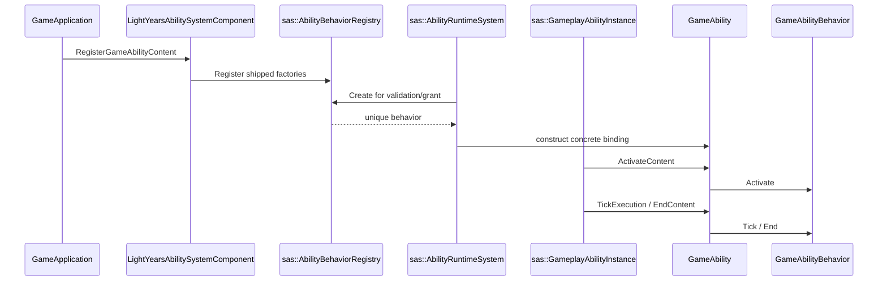

# Ability Behavior Registration and Dispatch Flow

Registry storage ve generic instance yaşam döngüsü SAS'a aittir. Content
bootstrap ile Actor/weapon/attachment/action çağrıları LightYearsGame'de kalır.
Build/test tüm taşıma sonunda çalıştırılacaktır.
