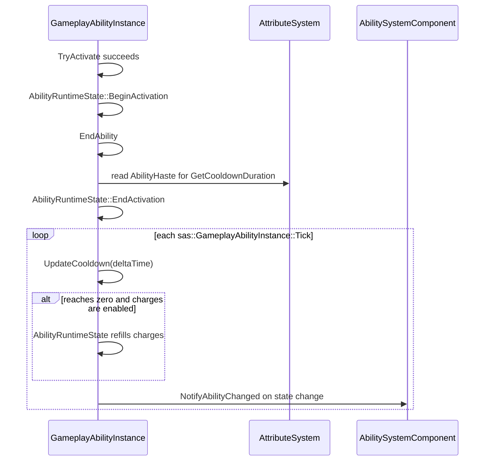

# Ability Cooldown and Charge Flow

## Kapsam

Bu not, `sas::GameplayAbilityInstance` tabanındaki effective cooldown hesabını, cooldown tick'ini, charge tüketimi/geri yüklenmesini ve bildirim girişini açıklar. Level progression, attachment sisteminin kendisi ve cooldown azaltan action producer'ları ayrıntılı olarak incelenmez.

## Runtime state

- `sas::AbilityRuntimeState::GetCooldownRemaining`: `CanActivate` gate'inde okunur.
- `sas::AbilityRuntimeState::GetCharges`: state oluşturulurken `definition.maxCharges` ile başlar; `BeginActivation` başarılı akışta bir azaltır.
- `mDefinition.maxCharges <= 0`: charge gate'i ve reload davranışı uygulanmaz.

| Adım | Dosya / sembol | Okunan veri | Değiştirilen runtime state | Sonraki çağrı |
|---|---|---|---|---|
| Başlangıç | `GameplayAbilityInstance.h::GameplayAbilityInstance` | `definition.maxCharges`, definition | definition kopyaları + `mRuntimeState` | Input/tick |
| Activation gate | `GameplayAbilityInstance.h::TryActivate` | `mRuntimeState.CanActivate`, tag/behavior sonucu | Başarısızsa yok | `BeginActivation` |
| Charge consume | `AbilityRuntimeState::BeginActivation` | `maxCharges`, charges | charge decrement + active state | Active lifecycle |
| Cooldown başlangıcı | `AbilityRuntimeState::EndActivation` | Final cooldown | cooldown, active state, gerekirse charge reset | `UpdateCooldown` |
| Cooldown tick | `AbilityRuntimeState::TickCooldown` | Remaining, effective duration, `deltaTime` | Remaining ve completion'da charges | Adapter notification |
| Completion | `TickCooldown` | `maxCharges` | charges = maxCharges | Sonraki input activation |

Dosya: `SpaceAbilitySystem/include/abilities/GameplayAbilityInstance.h`  
Sınıf: `sas::GameplayAbilityInstance<Definition, Execution>`  
Fonksiyon: constructor  
Görev: Runtime definition kopyasını ve başlangıç charge sayısını kurar.

```cpp
	GameplayAbilityInstance(
		AbilityHandle handle,
		const Definition& definition,
		AbilityInstanceNotifications notifications = {}
	)
		: Base{ handle, definition, definition.maxCharges },
		mNotifications{ std::move(notifications) }
	{
	}
```

## Effective cooldown süresi

`GetCooldownDuration` şu sırayı uygular:

1. Instance'ın private `mDefinition.cooldown` değeri ve definition-local modifier'ları çözülür.
2. Ability attachment modifier'ları çözülmüş cooldown attribute'üne uygulanır.
3. Owner `AbilityHaste` current attribute değeri `AttributeMath::GetAbilityCooldownMultiplier` ile çarpana dönüştürülür.
4. Sonuç sıfırın altına düşemez.

Bu, cooldown formulelerinin tüm balance/progression kaynaklarının kataloğu değildir; burada yalnız aktivasyon runtime'ına giren hesaplama doğrulanmıştır.

Dosya: `SpaceAbilitySystem/include/abilities/GameplayAbilityInstance.h`  
Sınıf: `sas::GameplayAbilityInstance<Definition, Execution>`  
Fonksiyon: `GetCooldownDuration`  
Görev: Runtime effective cooldown süresini attribute ve attachment girdileriyle hesaplar.

```cpp
		const float leveledCooldown = sas::CalculateModifiedAttributeValue(
			sas::GameplayAttribute{ CommonAttributeIds::Cooldown, mDefinition.cooldown, 0.f },
			mDefinition.attributeModifiers
		);
		const float attachmentModifiedCooldown = ApplyAttachmentModifiers(
			AttachmentHostKind::Ability,
			sas::GameplayAttribute{ CommonAttributeIds::Cooldown, leveledCooldown, 0.f }
		).currentValue;
		const float hasteMultiplier = sas::AttributeMath::GetAbilityCooldownMultiplier(
			mAbilitySystem.GetAttributes().GetCurrentValue(OwnerAttributeIds::AbilityHaste)
		);
		return std::max(0.f, attachmentModifiedCooldown * hasteMultiplier);
```

## Akış



## End, tick ve recharge

Ability bittiğinde `EndAbility`, effective duration ile cooldown'ı başlatır. Süre zaten sıfır veya negatifse charge-enabled instance hemen `maxCharges` durumuna döner. Tick yolunda remaining süre güncel effective süre ile üstten sınırlanır, `deltaTime` kadar azalır ve sıfıra ulaşınca **tüm charges** `maxCharges` değerine ayarlanır. Kodda tek tek veya kademeli charge refill doğrulanmadı.

`TryActivate`'ın başarısız cooldown/charge/tag/behavior gate'leri cooldown başlatmaz ve charge tüketmez. Son charge için özel bir cooldown başlangıç dalı yoktur: başarıyla aktive olan ability bittiğinde, kalan charge sayısından bağımsız olarak `EndAbility` aynı cooldown yolunu çalıştırır. Ayrı charge timer'ı veya accumulator bulunmadı.

`sas::GameplayAbilityInstance::Tick` sırası `UpdateCooldown` → `UpdateInputActivation` olduğundan `WhileHeld` input hâlâ basılıysa cooldown completion sonrası aynı tick'te yeni activation denemesi mümkündür; standart cooldown/charge/tag/behavior gate'leri yeniden uygulanır.

Dosya: `SpaceAbilitySystem/include/abilities/GameplayAbilityInstance.h`  
Sınıf: `sas::GameplayAbilityInstance<Definition, Execution>`  
Fonksiyon: `EndAbility`  
Görev: Active state'i kapatır ve cooldown başlangıç state'ini kurar. Kesit, fonksiyonun ilgili gerçek satırlarıdır.

```cpp
		EndContent(reason);
		EndExecution(reason);
		const float cooldownOnEnd = this->mDefinition.cooldownStartPolicy ==
			AbilityCooldownStartPolicy::OnActivation
			? this->mRuntimeState.GetCooldownRemaining()
			: ResolveCooldownDurationOnEnd(reason);
		this->mRuntimeState.EndActivation(
			cooldownOnEnd,
			this->mDefinition.maxCharges
		);
		if (mNotifications.ended)
		{
			mNotifications.ended(this->mHandle, reason);
		}
```

Dosya: `SpaceAbilitySystem/include/abilities/GameplayAbilityInstance.h`  
Sınıf: `sas::GameplayAbilityInstance<Definition, Execution>`  
Fonksiyon: `UpdateCooldown`  
Görev: Cooldown state'ini tick eder, charge'ları geri yükler ve değişikliği bildirir.

```cpp
	void UpdateCooldown(float deltaTime)
	{
		if (this->mRuntimeState.IsOnCooldown() &&
			this->mRuntimeState.TickCooldown(
				deltaTime,
				ResolveCooldownDuration(),
				this->mDefinition.maxCharges
			))
		{
			NotifyChanged();
		}
	}
```

## Haricî cooldown azaltma girişi

`ReduceCooldownRemaining(amount)`, yalnız pozitif miktar ve pozitif remaining süre için çalışır; sonucu sıfıra clamp eder ve state değişmişse `NotifyAbilityChanged` çağırır. Bu fonksiyonu çağıran gameplay feature'ları bu incelemenin dışındadır.

## Kaldırma, yeniden grant ve trigger cooldown sınırı

`sas::AbilitySystemComponent::RemoveAbility`, instance'ı `Cancel` ettikten sonra runtime collection'dan siler; böylece o instance'ın cooldown ve charge state'i yaşamaya devam etmez. Aynı ID ile removal sonrasında yeniden grant, yeni `GameAbility`/`sas::GameplayAbilityInstance` constructor'ı çalıştığı için state'i `definition.maxCharges` ve sıfır cooldown ile başlatır. Ancak ability hâlâ kayıtlıyken aynı `abilityId` için `GrantAbility`, mevcut handle'ı döndürür; state korunur.

Gameplay-event trigger cooldown, `sas::GameplayAbilityInstance` state'inden ayrı SAS trigger runtime alanında tutulabilir; bu cooldown/charge sembol setiyle doğrudan bağlantısı doğrulanmadı.

## Doğrulanmayan / sonraki inceleme

- Cooldown reduction çağrılarının tüm producer'ları çıkarılmadı.
- Charge'ların neden yalnız cooldown sonunda topluca yenilendiği bir tasarım notuyla doğrulanmadı.
- Cooldown/charge test kapsamı çalıştırılmadı veya bu turda incelenmedi.
