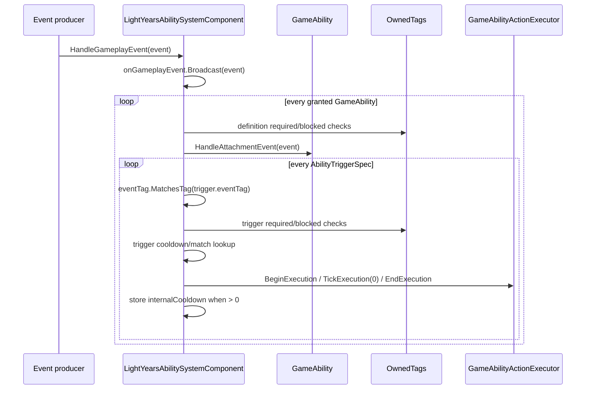

# Ability Gameplay Event and Trigger Flow

## Kapsam

Bu not, `LightYearsAbilitySystemComponent::ProcessGameGameplayEvent` ile `sas::AbilitySystemRuntime<GameAbilityDefinition, GameAbility>::HandleGameplayEvent` içindeki event-triggered execution girişini ve trigger internal cooldown kaydını açıklar. Ability action türleri, event producer'larının tamamı ve action executor implementasyonları kapsam dışındadır.

## Veri kontratları

`sas::AbilityEvent`, event tag'i, magnitude, kaynak ability kimliği/tag'leri, payload tag'leri ve type-erased source/target/context taşıyabilir. Her `GameAbilityDefinition`, sıfır veya daha çok `AbilityTriggerSpec` barındırabilir. Trigger, `sas::AbilityTrigger` alanlarına ek olarak game action listesi taşır; required/blocked tag, source ability/payload filtreleri, match limiti ve optional `internalCooldown` içerir.

Dosya: `SpaceAbilitySystem/include/abilities/AbilityEvent.h`  
Sınıf: `sas::AbilityEvent`  
Fonksiyon: veri tanımı  
Görev: Trigger işleminin aldığı event payload'ını taşır.

```cpp
	struct AbilityEvent
	{
		GameplayTag eventTag;
		float magnitude = 0.f;
		ContentId sourceAbilityId;
		ly::List<ly::GameplayTag> sourceAbilityTags;
		ly::List<ly::GameplayTag> payloadTags;
	};
```

Dosya: `LightYearsGame/include/gameplay/ability/content/GameAbilityDefinition.h`  
Sınıf: `AbilityTriggerSpec`  
Fonksiyon: veri tanımı  
Görev: Bir definition içindeki event-match ve execution konfigürasyonunu taşır.

```cpp
	struct AbilityTriggerSpec : sas::AbilityTrigger
	{
		List<AbilityActionSpec> actions;
	};
```

## Akış



## Trigger gate ve execution girişi

Önce ability definition'ın owner-tag gate'i uygulanır. Her trigger için `MatchesAbilityTrigger` event/tag/source/payload match'i, `mTriggerCooldowns` ve `mTriggerMatchCounts` kontrolü yapılır. Kabul edilen trigger, `LightYearsAbilitySystemComponent::ExecuteTriggeredActions` içinde original definition'ın kopyasına trigger actions yazılarak geçici `GameAbilityExecution` üzerinden başlatılır; aynı çağrıda `TickExecution(..., 0.f)` ve `EndExecution(...Completed)` yapılır.

Dosya: `SpaceAbilitySystem/include/abilities/AbilitySystemRuntime.h`  
Sınıf: `sas::AbilitySystemRuntime<GameAbilityDefinition, GameAbility>`  
Fonksiyon: `HandleGameplayEvent`  
Görev: Ability-level ve trigger-level gate'lerden sonra trigger execution'a geçer. Kesit, fonksiyonun ilgili gerçek satırlarıdır.

```cpp
		const Definition definition = ability->GetDefinition();
		if (!ownedTags.HasAll(definition.requiredOwnerTags) ||
			ownedTags.HasAny(definition.blockedOwnerTags))
		{
			continue;
		}
		std::invoke(handleInstanceEvent, *ability, event);
		for (std::size_t triggerIndex = 0;
			triggerIndex < definition.triggers.size();
			++triggerIndex)
		{
			const AbilityTriggerSpec& trigger = definition.triggers[triggerIndex];
			if (!MatchesAbilityTrigger(event, trigger, ownedTags))
			{
				continue;
			}
```

Dosya: `SpaceAbilitySystem/include/abilities/AbilitySystemRuntime.h`  
Sınıf: `sas::AbilitySystemRuntime<GameAbilityDefinition, GameAbility>`  
Fonksiyon: `HandleGameplayEvent`  
Görev: Cooldown kabulünden sonra geçici execution başlatır ve internal cooldown state'ini yazar. Kesit, aynı fonksiyonun ilgili gerçek satırlarıdır.

```cpp
			const std::string cooldownKey = MakeAbilityTriggerCooldownKey(
				definition.abilityId,
				trigger,
				triggerIndex
			);
			if (mTriggerCooldowns.IsActive(cooldownKey))
			{
				continue;
			}

			std::invoke(executeTrigger, *ability, definition, trigger, event);

			if (trigger.internalCooldown > 0.f)
			{
				mTriggerCooldowns.Start(cooldownKey, trigger.internalCooldown);
			}
```

## Trigger cooldown giriş noktası

Bu, ability instance cooldown'undan ayrı `sas::AbilitySystemRuntime` state'idir. Key, `abilityId|eventTag|triggerIndex` biçiminde `MakeAbilityTriggerCooldownKey` ile üretilir; runtime `Tick(deltaTime)` içinde `AbilityCooldownTracker::Tick` her pozitif kaydı azaltır ve bitenleri temizler. Cooldown formülü, ability cooldown multiplier'ı veya charge yenilemesi burada incelenmedi.

Dosya: `SpaceAbilitySystem/include/abilities/AbilitySystemRuntime.h`  
Sınıf: `sas::AbilitySystemRuntime<GameAbilityDefinition, GameAbility>`  
Fonksiyon: `Tick` / `Clear`  
Görev: Trigger cooldown tracker'ını tick eder ve runtime temizlenirken match/cooldown state'ini siler.

```cpp
	void Tick(float deltaTime) override
	{
		mTriggerCooldowns.Tick(deltaTime);
		mRuntime.Tick(deltaTime);
	}

	void Clear() override
	{
		mRuntime.Clear();
		mTriggerCooldowns.Clear();
		mTriggerMatchCounts.clear();
	}
```

## Doğrulanan sınırlar

- `GameplayEvent` activation policy'nin doğrudan `TryActivate` çağrısı bu akışta görülmez; event-triggered execution `HandleGameplayEvent` üzerinden action execution başlatır.
- Event producer'larının tümü ve trigger action semantiği bu dar incelemede çıkarılmadı.
- Test/build çalıştırılmadı.
