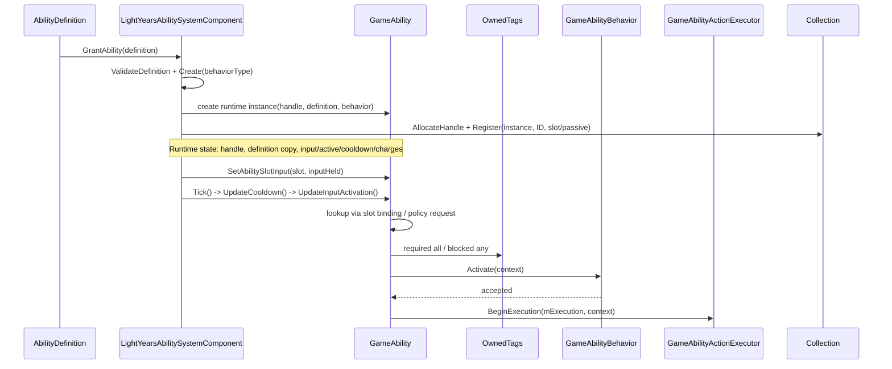

# Ability Grant and Activation Flow

## Akış



## Adım ayrıntıları

| Adım | Dosya / sembol | Kısa görev | Okunan veri | Değişen runtime state |
|---|---|---|---|---|
| 1. Definition seçimi | `GameAbilityDefinition.h` / `GameAbilityDefinition` | Config kontratını sağlar | ID, SAS-owned slot/policy, tag koşulları, behavior ID | Yok |
| 2. Runtime oluşturma | `SpaceAbilitySystem/include/abilities/AbilityRuntimeSystem.h` / `GrantAbility` | Behavior üretir; SAS collection'dan handle alıp instance kaydeder | Definition ve collection | Instance/ID/slot/passive indeksleri |
| 3. Owner kaydı | `LightYearsGame/include/gameplay/ability/LightYearsAbilitySystemComponent.h` / `mComponentRuntime` | Owner'ın typed ability runtime'ını value member olarak tutar | Owner runtime | Component ömrü CombatRuntime'a bağlanır |
| 4. Input isteği | `LightYearsGame/include/gameplay/ability/LightYearsAbilitySystemComponent.h` / `SetAbilitySlotInput` | Slot'tan runtime instance'a input taşır | `AbilitySlot`, `inputHeld` | `sas::AbilityRuntimeState` input state |
| 5. Lookup | `LightYearsGame/include/gameplay/ability/LightYearsAbilitySystemComponent.h` / `GetAbility` | Slot/handle veya ID indeksinden instance bulur | Binding, handle veya `abilityId` | Yok |
| 6. Uygunluk | `SpaceAbilitySystem/include/abilities/GameplayAbilityInstance.h` / `TryActivate` | Active/cooldown/charge/tag/behavior gate'leri | Instance state, owner tags | Başarısızsa yok |
| 7. Başlatma | `SpaceAbilitySystem/include/abilities/GameplayAbilityInstance.h` / `TryActivate` | Instance'ı aktif yapar ve event verir | Definition lifetime, behavior sonucu | `AbilityRuntimeState::BeginActivation`, execution actions |
| 8. Sonraki katman | `GameAbilityActionExecutor.h` / `BeginExecution` | Game action execution başlangıç noktasını alır | `AbilityExecutionContext` | Execution runtime başlatılır |

## Kritik gerçek kod

Dosya: `LightYearsGame/src/gameplay/ability/LightYearsAbilitySystemComponent.cpp`  
Sınıf: `ly::LightYearsAbilitySystemComponent`  
Fonksiyon: `SetAbilitySlotInput`  
Görev: Slot binding üzerinden bulunmuş instance'a input state'i iletir.

```cpp
	void LightYearsAbilitySystemComponent::SetAbilitySlotInput(
		sas::AbilitySlot slot,
		bool inputHeld
	)
	{
		sas::AbilitySystemComponent::SetAbilitySlotInput(slot, inputHeld);
		mAbilityInvocationRuntime.SetControlInput(slot, inputHeld);
	}
```

Dosya: `SpaceAbilitySystem/include/abilities/AbilityRuntimeSystem.h`  
Sınıf: `sas::AbilityRuntimeSystem<Definition, Instance>`  
Fonksiyon: `Tick`  
Görev: Her runtime ability instance'ına frame tick'i yönlendirir.

```cpp
	void AbilityRuntimeSystem<Definition, Instance>::Tick(float deltaTime)
	{
		if (!mCallbacks.tick)
		{
			return;
		}
		for (const AbilityHandle handle : GetHandles())
		{
			if (Instance* ability = mAbilities.Find(handle))
			{
				mCallbacks.tick(*ability, deltaTime);
			}
		}
	}
```

Dosya: `SpaceAbilitySystem/include/abilities/GameplayAbilityInstance.h`  
Sınıf: `sas::GameplayAbilityInstance<Definition, Execution>`  
Fonksiyon: `UpdateInputActivation`  
Görev: Activation policy'ye göre `TryActivate` girişini seçer.

```cpp
	void UpdateInputActivation()
	{
		if (this->mRuntimeState.IsActive() &&
			this->mRuntimeState.IsPressedThisFrame() &&
			HandleInputPressed())
		{
			return;
		}

		const AbilityLifecycleDecision decision =
			AbilityLifecycleOrchestrator::EvaluateInput(
				this->mDefinition.activationPolicy,
				this->mDefinition.lifetimePolicy,
				this->mRuntimeState
			);
		if (decision.requestEnd)
		{
			EndAbility(decision.endReason);
		}
		else if (decision.requestActivation)
		{
			TryActivate();
		}
	}
```

Dosya: `SpaceAbilitySystem/include/abilities/GameplayAbilityInstance.h`  
Sınıf: `sas::GameplayAbilityInstance<Definition, Execution>`  
Fonksiyon: `Tick`  
Görev: Cooldown update sonrasında input activation kontrolüne iner.

```cpp
	void Tick(float deltaTime)
	{
		UpdateCooldown(deltaTime);
		UpdateInputActivation();

		if (this->mRuntimeState.IsActive())
		{
			this->mRuntimeState.TickActiveTime(deltaTime);
			TickExecution(deltaTime);
			const AbilityLifecycleDecision durationDecision =
				AbilityLifecycleOrchestrator::TickActiveDuration(
					this->mDefinition.lifetimePolicy,
					this->mRuntimeState,
					deltaTime
				);
			if (durationDecision.stateChanged)
			{
				NotifyChanged();
			}
			if (durationDecision.requestEnd)
			{
				EndAbility(durationDecision.endReason);
			}
		}
		else
		{
			TickInactive(deltaTime);
		}

		this->mRuntimeState.CommitInputFrame();
	}
```

## Okuma sırası

1. `GameAbilityDefinition.h::GameAbilityDefinition`
2. `SpaceAbilitySystem/include/abilities/AbilityRuntimeSystem.h::GrantAbility`
3. `LightYearsGame/include/gameplay/ability/LightYearsAbilitySystemComponent.h::SetAbilitySlotInput` ve `Tick`
4. `SpaceAbilitySystem/include/abilities/GameplayAbilityInstance.h::UpdateInputActivation`
5. `SpaceAbilitySystem/include/abilities/GameplayAbilityInstance.h::TryActivate`
6. `GameAbilityActionExecutor::BeginExecution`

## Sonraki inceleme

Gameplay-event activation producer'ları, trigger cooldown, charge yenileme, action türleri ve behavior family implementasyonları bu walkthrough'da incelenmedi.

## Kaynak doğrulaması

- İncelenen durum: dirty worktree; test/build çalıştırılmadı.
- Definition veya runtime state olmayan bir GameplayTag lookup yolu doğrulanmadı; tag'ler koşul sorgularında kullanılır.
