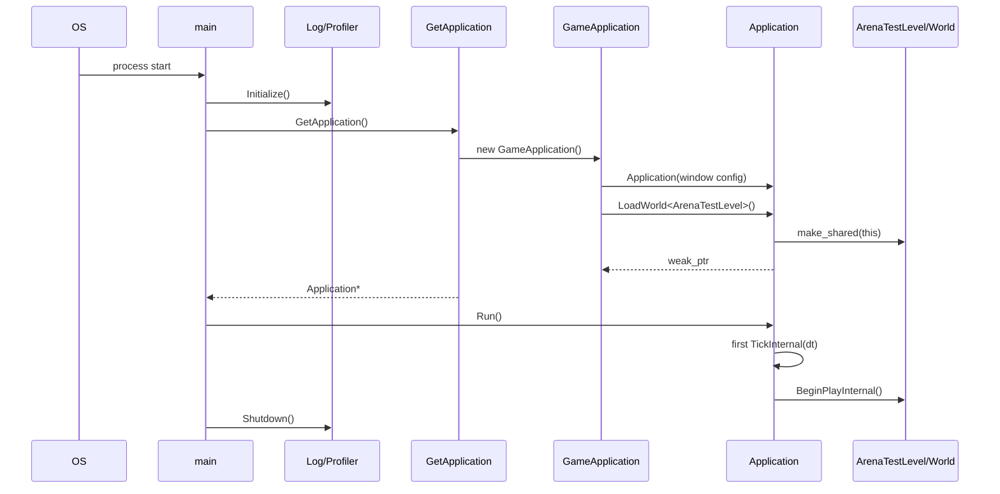

# Application Startup Flow

## 7 Eylül 2026 kaynak kontrolü

Güncel gerçek giriş GameApplication::GameApplication → asset root → GameContentBootstrap::Register → LoadWorld<ArenaTestLevel>. Bootstrap başarısızsa quit. Test arena normal dalgalı run değildir. [[00 - Runtime Snapshot]].

Bu ek kaynak incelemesidir; build/test çalıştırılmadı. Aşağıdaki eski örnekler tarihsel inceleme kapsamını taşır; bu güncelleme ile çelişen ayrıntılar güncel davranış kabul edilmemeli.




## Adım 1 — Executable giriş noktası

- Dosya: `LightYearsEngine/src/EntryPoint.cpp`
- Sembol: `main`
- Çağıran: İşletim sistemi/runtime
- Çağrılan: `GetApplication`
- State değişikliği: Logger `LightYears.log` hedefiyle, Debug profiler da
  aggregate state'iyle başlar; ardından Application için `unique_ptr`
  sahipliği başlar.
- Sonraki adım: Somut `GameApplication` oluşturulur.

Dosya: `LightYearsEngine/src/EntryPoint.cpp`  
Sınıf veya namespace: global  
Fonksiyon: `main`  
Görevi: Diagnostics yaşam döngüsünü başlatmak, factory’den Application almak
ve null/exception durumlarını structured fatal log ile raporlamak.

```cpp
ly::debug::Log::Initialize("LightYears.log");
ly::debug::Profiler::Initialize();
std::unique_ptr<ly::Application> app{ GetApplication() };
if (!app)
{
	LY_CORE_FATAL("Failed to create application");
	ly::debug::Profiler::Shutdown();
	ly::debug::Log::Shutdown();
	return 1;
}
```

## Adım 2 — Somut uygulamanın oluşturulması

- Dosya: `LightYearsGame/src/gameFramework/GameApplication.cpp`
- Sembol: `GetApplication`
- Çağıran: `main`
- Çağrılan: `ly::GameApplication::GameApplication`
- State değişikliği: Heap üzerinde somut uygulama oluşur.
- Sonraki adım: Base Application window’u ve runtime alanlarını kurar.

Dosya: `LightYearsGame/src/gameFramework/GameApplication.cpp`  
Sınıf veya namespace: global  
Fonksiyon: `GetApplication`  
Görevi: Engine entry point’ini game executable’daki somut uygulamaya bağlamak.

```cpp
ly::Application* GetApplication()
{
	return new ly::GameApplication();
}
```

## Adım 3 — Window ve ilk content/world talebi

- Dosya: `LightYearsGame/src/gameFramework/GameApplication.cpp`
- Sembol: `ly::GameApplication::GameApplication`
- Çağıran: `GetApplication`
- Çağrılan: `ly::Application::Application`, content registration, `LoadWorld<ArenaTestLevel>`
- State değişikliği: Window kurulumu, asset root/content kayıtları ve `mPendingWorld`.
- Sonraki adım: `main`, `Application::Run` çağırır.

Dosya: `LightYearsGame/src/gameFramework/GameApplication.cpp`  
Sınıf veya namespace: `ly`  
Fonksiyon: `GameApplication::GameApplication`  
Görevi: Somut window ayarlarını, content registration’ı ve başlangıç world talebini kurmak. Registration ayrıntıları core runtime kapsamı için çıkarılmadı.

```cpp
GameApplication::GameApplication()
	: Application({ 1920, 1080}, 64, std::string("LightYears"), sf::Style::Close | sf::Style::Titlebar)
{
	AssetManager::GetAssetManager().SetAssetRootDirectory(getResourceDir());
	if (!LightYearsAbilitySystemComponent::RegisterGameContent())
	{
		LY_GAME_ERROR("Failed to register game gameplay-effect content");
	}
	if (!RegisterGameAbilityContent())
	{
		LY_GAME_ERROR("Failed to register game ability content");
	}

	ly::perf::g_disableLights.store(false);

	LoadWorld<ArenaTestLevel>();
}
```

## Adım 4 — Pending world tahsisi

- Dosya: `LightYearsEngine/include/framework/Application.h`
- Sembol: `ly::Application::LoadWorld`
- Çağıran: `GameApplication::GameApplication`
- Çağrılan: `WorldType` constructor
- State değişikliği: `mPendingWorld` yeni world’ü güçlü referansla tutar.
- Sonraki adım: İlk frame tick sonunda pending world current olur.

Dosya: `LightYearsEngine/include/framework/Application.h`  
Sınıf veya namespace: `ly::Application`  
Fonksiyon: `LoadWorld`  
Görevi: World’ü Application raw pointer’ıyla kurup geçiş kuyruğuna almak.

```cpp
auto newWorld = std::make_shared<WorldType>(this);
mPendingWorld = newWorld;
return newWorld;
```

## Adım 5 — Loop’un başlaması

- Dosya: `LightYearsEngine/src/EntryPoint.cpp`
- Sembol: `main`
- Çağıran: `main`
- Çağrılan: `Application::Run`
- State değişikliği: Tick clock restart edilir; window açık olduğu sürece frame loop çalışır.
- Sonraki adım: İlk `TickInternal`.

Dosya: `LightYearsEngine/src/EntryPoint.cpp`  
Sınıf veya namespace: global  
Fonksiyon: `main`  
Görevi: Loop tamamlandıktan sonra Application’ı normal yoldan bırakmak,
profiler özetini yazmak ve logger'ı flush ederek kapatmak.

```cpp
app->Run();
app.reset();
ly::debug::Profiler::Shutdown();
ly::debug::Log::Shutdown();
std::quick_exit(0);
```

## Adım 6 — İlk world aktivasyonu

- Dosya: `LightYearsEngine/src/framework/Application.cpp`
- Sembol: `ly::Application::TickInternal`
- Çağıran: `Application::Run`
- Çağrılan: timer clear, physics reset, `World::BeginPlayInternal`
- State değişikliği: Pending world current olur ve began-play state’i açılır.
- Sonraki adım: Sonraki frame’lerde normal World tick.

Dosya: `LightYearsEngine/src/framework/Application.cpp`  
Sınıf veya namespace: `ly::Application`  
Fonksiyon: `TickInternal`  
Görevi: İlk pending world’ü frame sonunda aktive etmek.

```cpp
mCurrentWorld = nullptr;

TimerManager::GetGameTimerManager().ClearAllTimers();
TimerManager::GetGlobalTimerManager().ClearAllTimers();

PhysicsSystem::Get().Cleanup();
PhysicsSystem::Get().InitializeWorld({ 0.f,0.f });

mCurrentWorld = mPendingWorld;
mCurrentWorld->BeginPlayInternal();
```

## Test ve doğrulama

### Mevcut testler

Test binary’sinin kendi `main` fonksiyonu vardır; core gameplay nesnelerini çalıştırır. Ancak production `EntryPoint.cpp` → `GetApplication` → `Run` yolu test target’ında doğrudan yürütülmez.

### Doğrudan test edilmeyen davranışlar

Factory null erken çıkışı, `GameApplication` constructor registration başarısızlığı sonrası devam davranışı, ilk world’ün ilk frame sonunda aktivasyonu ve `quick_exit` yolu. Logger/filter ve profiler macro kontratı engine lifetime testinde doğrulanır; production dosya açma ve exception kapanış sırası bu walkthrough kapsamında doğrudan çalıştırılmaz.

### Manuel doğrulama gereken noktalar

Pencere yaratma, resource directory, ilk ArenaTestLevel görünümü ve platform runtime kapanışı.

### Önerilen fakat henüz bulunmayan testler

- Test Application türeviyle `LoadWorld`ün pending oluşturup ilk tick’te BeginPlay çağırması.
- Factory ve null-factory entrypoint smoke testi.
- Registration başarısız olsa da Application’ın kontrollü başlamasını doğrulayan test.

## Kod Okuma Sırası

1. `LightYearsEngine/src/EntryPoint.cpp`
2. `LightYearsEngine/include/EntryPoint.h`
3. `LightYearsGame/src/gameFramework/GameApplication.cpp`
4. `LightYearsEngine/include/framework/Application.h`
5. `LightYearsEngine/src/framework/Application.cpp`
6. `LightYearsEngine/src/framework/World.cpp`
