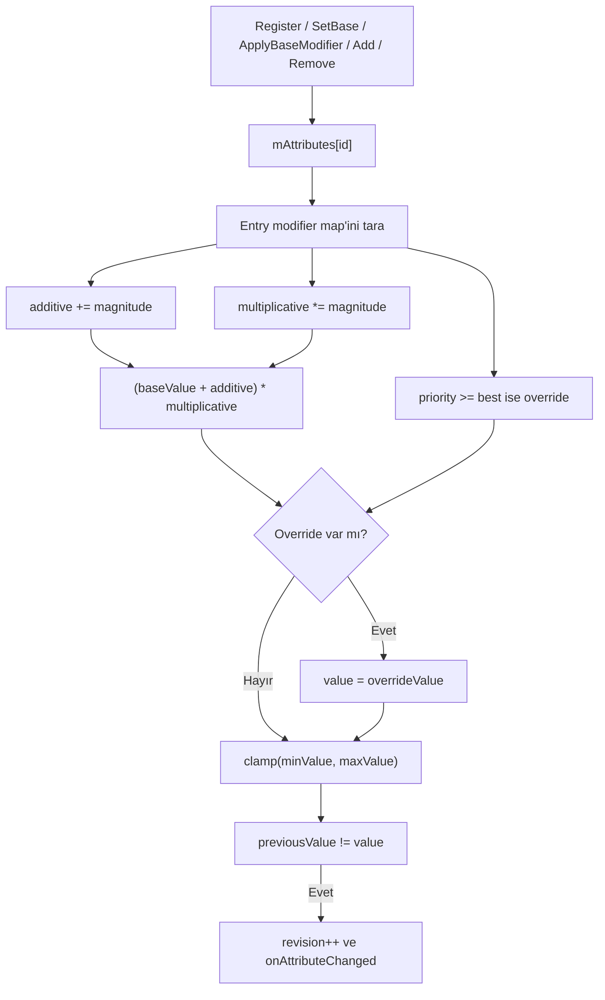

# Attribute Resolution Flow

## Amaç

Bir attribute kaydı veya mutasyonu sonrasında `currentValue` değerinin hangi sırayla çözüldüğünü gösterir.

Akış artık statik `SpaceAbilitySystem` target'ında ve `sas` namespace'inde
çalışır. Aşama 1 yalnız sahiplik/yol/namespace değişikliğidir; aşağıdaki çözüm
sırası değiştirilmemiştir.

## Akış



## Çözüm sırası

1. `baseValue` başlangıç değeridir.
2. Aynı attribute'e ait tüm Add magnitudeları toplanır.
3. Tüm Multiply magnitudeları doğrudan birbiriyle çarpılır.
4. `(base + add) × multiply` hesaplanır.
5. Override varsa sonuç tamamen en yüksek priority değerine çevrilir.
6. Sonuç min/max aralığına clamp edilir.
7. `currentValue` gerçekten değiştiyse revision ve delegate ilerler.

`GetSequentialReductionMultiplier` bu normal akış değildir. `MovementSlow` ve benzeri bağımsız reduction kaynaklarını `1 - reduction` çarpanlarına çevirip sıralı çarpar.

## Kritik gerçek kod

Dosya: `SpaceAbilitySystem/src/attributes/AttributeSystem.cpp`  
Sınıf veya namespace: `sas::AttributeSystem`  
Fonksiyon: `SetBaseValue`  
Görevi: Yeni base değeri önce attribute sınırlarına clamp edip çözümü tetikler.

```cpp
		GameplayAttribute& attribute = mAttributes[id].attribute;
		attribute.baseValue = std::clamp(baseValue, attribute.minValue, attribute.maxValue);
		Recalculate(id);
```

Dosya: `SpaceAbilitySystem/src/attributes/AttributeSystem.cpp`  
Sınıf veya namespace: `sas::AttributeSystem`  
Fonksiyon: `Recalculate`  
Görevi: Add ve Multiply accumulator'larını toplar.

```cpp
			case AttributeModifierOperation::Add:
				additive += modifier.magnitude;
				break;
			case AttributeModifierOperation::Multiply:
				multiplicative *= modifier.magnitude;
				break;
```

Dosya: `SpaceAbilitySystem/src/attributes/AttributeSystem.cpp`  
Sınıf veya namespace: `sas::AttributeSystem`  
Fonksiyon: `Recalculate`  
Görevi: Priority karşılaştırmasıyla override adayını seçer.

```cpp
			case AttributeModifierOperation::Override:
				if (!hasOverride || modifier.priority >= bestOverridePriority)
				{
					hasOverride = true;
					bestOverridePriority = modifier.priority;
					overrideValue = modifier.magnitude;
				}
				break;
```

Dosya: `SpaceAbilitySystem/src/attributes/AttributeSystem.cpp`  
Sınıf veya namespace: `sas::AttributeSystem`  
Fonksiyon: `RemoveModifier`  
Görevi: Reverse handle lookup ile doğru attribute'ten modifier'ı kaldırıp yeniden hesaplar.

```cpp
		const GameplayTag attributeId = foundAttribute->second;
		auto foundEntry = mAttributes.find(attributeId);
		if (foundEntry != mAttributes.end())
		{
			foundEntry->second.modifiers.erase(handle.id);
			Recalculate(attributeId);
		}
```

## Test ve kaynak doğrulaması

- `(10 + 5) × 2 = 30` test edilir.
- Multiply kaldırma + instant base Add sonrası `20` test edilir.
- Sequential reduction `0.1 + 0.1` için toplamsal `0.8` değil, `0.81` üretir.
- Override priority ve equal-priority tie doğrudan test edilmez.
- Debug/Release `exit 0` ve 2026-07-29 CTest 2/2 sonucu tarihsel kayıttır;
  bu docs-only denetiminde güncel build/test çalıştırılmadı.

## Okuma sırası

1. `AttributeModifierOperation`
2. `GameplayAttributeEntry`
3. Public mutation fonksiyonları
4. `Recalculate`
5. `GetSequentialReductionMultiplier`
6. Testte `AttributeSystem attributes` bloğu
