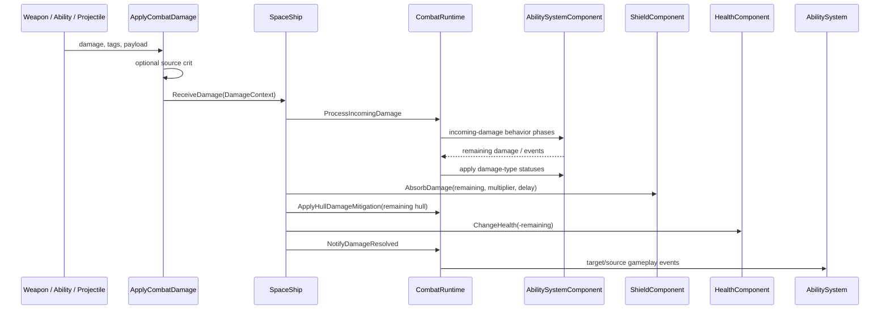

# Damage and Shield Resolution Flow

## Amaç

Bu walkthrough, combat-aware `SpaceShip` hedefe gelen tek bir hit için doğrulanan sırayı gösterir. Status effect'in sonraki tick'leri, projectile impact üretimi ve UI presentation bu akışın dışındadır.

## 1. Hit context oluşturma

Producer, `ApplyCombatDamage` helper'ına numeric damage, source, damage tags ve önceden oluşturulmuş `DamagePayload` verir. Helper source `Combatant` ise crit chance'i kontrol eder; context'e resolved `originalDamage`, `remainingDamage` ve `wasCritical` değerlerini koyar. Target combatant değilse flow burada biter ve doğrudan actor damage çağrılır.

## 2. Effect phase ve armor

`SpaceShip::ReceiveDamage`, invulnerability gate'inden sonra context'i
`CombatRuntime::ProcessIncomingDamage`a verir. Effect system incoming-damage
behavior'larını çalıştırır; Electric ilk stack’ten itibaren burada çözülür.
Status uygulaması remaining damage pozitifken aynı ASC'ye yapılır. Ardından
shield/overshield emilimi gerçekleşir ve yalnız kalan hull hasarı ortak
`CombatRuntime::ApplyHullDamageMitigation` içinde Armor + penetration hesabından
geçer. Kinetic stack penetration bu son aşamaya eklenir; shield-only hasar
Armor tarafından değiştirilmez.

Effect pending event'leri ability system'e gider; status uygulama zamanı bu aşamada korunur.

## 3. Status ve ship shield

Remaining damage pozitifse `DamageTypeSystem::ApplyStatusEffects`, target effect sistemine ilgili status spec'lerini uygular. Bu çağrı damage'i anlık olarak tekrar hesaplamaz; status'ların sonraki behavior/tick sonuçları ayrı lifecycle'dır.

Sonra `SpaceShip` remaining damage'i legacy `ShieldComponent::AbsorbDamage`a verir. Dönen değer source-damage cinsinden absorbed miktardır; context'te `absorbedDamage` artar. Shield kapasitesinin azalması, `shieldDamageMultiplier` nedeniyle bu source miktarından farklı olabilir. Kalan hull damage ortak `CombatRuntime::ApplyHullDamageMitigation` ile Armor ve penetration'dan geçirilir; bu aşamadaki azaltım `mitigatedDamage`a eklenir ve `modifiedDamage` güncellenir. Son kalan damage health component'e uygulanır. `appliedDamage`, ship yolunda shield tarafından emilen source damage ile gerçek health düşüşünün toplamıdır.

## 4. Event ve delegate sonucu

`NotifyDamageResolved`, yalnız `appliedDamage > 0` ise:

- Hedef ability system'e `Event.Owner.DamageTaken`;
- Source combatant ability system'e `SourceDamageDealt`;
- CombatRuntime `onDamageResolved` delegate'ini

gönderir. `ProcessIncomingDamage` içindeki `onDamageProcessed` delegate'i bundan önce yayınlanmıştır.

## Shield yenilenmesi

Normal ship tick'inde `SpaceShip::UpdateRegeneration`, health delay/regeneration sonrası `ShieldComponent::Tick` çağırır. Recharge delay önce tüketilir, kalan delta'da shield regen uygulanır. Barrier effect ise `AbilitySystemComponent::Tick` üzerinden typed effect runtime'ında kendi runtime capacity'sini yeniler; bu iki regen loop'u bağımsızdır.

## Karar noktaları

| Koşul | Sonuç |
|---|---|
| Incoming damage ≤ 0 veya target invulnerable | Receive path ilerlemez |
| Non-combat target | Direct `Actor::ApplyDamage`; context pipeline yok |
| Barrier capacity mevcut | Effect aşamasında damage'in bir kısmı/ tamamı emilebilir |
| Ship shield mevcut | Incoming effect'lerden sonra, hull Armor öncesi kalan source damage'i emer |
| Remaining damage > 0 | Health azalır |
| `appliedDamage == 0` | Resolved gameplay event'leri yayınlanmaz |

## Kaynak doğrulaması

- Son doğrulanan commit: `b2e24c11d157c64b89bd1cf47c1390bf72784056`.
- Dirty worktree incelendi; `cmake --build build --parallel 4` ve `LightYearsGasLiteTests.exe` 2026-09-21 tarihinde çalıştırıldı.
