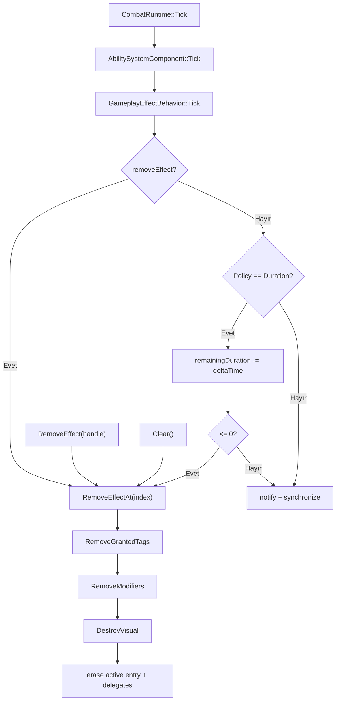

# Gameplay Effect Duration and Removal Flow

## Amaç

Aktif effect'in frame tick, explicit refresh, behavior-driven removal, duration expiry, manual remove ve runtime clear yollarını tek cleanup noktasına kadar izler.

## Akış



## Policy davranışı

| Policy | Tick davranışı | Normal bitiş |
|---|---|---|
| `Instant` | Active list'e girmez | Apply çağrısında applied/removed |
| `Duration` | Sayaç her tick azalır | `remainingDuration <= 0` |
| `Infinite` | Sayaç azalmaz | Behavior, manual remove veya clear |

`RefreshEffectDuration`, yalnız Duration policy için remaining ve total duration değerlerini spec duration'a resetler; modifier/tag/visual yeniden kurulmaz.

## Kritik gerçek kod

Dosya: `LightYearsGame/src/gameplay/combat/CombatRuntime.cpp`  
Sınıf veya namespace: `ly::CombatRuntime`  
Fonksiyon: `Tick`  
Görevi: Effect'leri aynı frame içinde ability'lerden önce günceller.

```cpp
	void CombatRuntime::Tick(float deltaTime)
	{
		mAbilitySystemComponent.Tick(deltaTime);
	}
```

Dosya: `SpaceAbilitySystem/include/effects/GameplayEffectRuntimeSystem.h`  
Sınıf veya namespace: `sas::GameplayEffectRuntimeSystem`  
Fonksiyon: `Tick`  
Görevi: Duration sayacını azaltır ve expiry'de ortak removal yoluna girer.

```cpp
			if (effect.spec.definition.durationPolicy == GameplayEffectDurationPolicy::Duration)
			{
				if (effect.TickDuration(deltaTime))
				{
					RemoveEffectAt(i);
					continue;
				}
```

Dosya: `SpaceAbilitySystem/include/effects/GameplayEffectRuntimeSystem.h`  
Sınıf veya namespace: `sas::GameplayEffectRuntimeSystem`  
Fonksiyon: `RefreshEffectDuration`  
Görevi: Duration state'i yıkmadan süreyi spec değerine resetler.

```cpp
			effect.RefreshDuration(effect.spec.duration);
			SynchronizeVisual(effect);
			onEffectChanged.Broadcast(effect.handle);
			onEffectsChanged.Broadcast();
			return true;
```

Dosya: `SpaceAbilitySystem/include/effects/GameplayEffectRuntimeSystem.h`  
Sınıf veya namespace: `sas::GameplayEffectRuntimeSystem`  
Fonksiyon: `Clear`  
Görevi: Storage'ı doğrudan silmek yerine her effect'i normal cleanup'tan geçirir.

```cpp
	void GameplayEffectRuntimeSystem::Clear()
	{
		for (const GameplayEffectHandle handle : GetHandles())
		{
			RemoveEffect(handle);
		}
	}
```

## Test ve kaynak doğrulaması

- Barrier behavior remove talebi ve runtime cleanup bağlantısı test edilir.
- Infinite barrier tick boyunca kalır ve runtime attributes değişir.
- Gravity Anomaly inside effect'i içeride refresh edilir; çıkış sonrası iki saniyelik tail sonunda kaldırılır.
- Manual `RemoveEffect` hareket değerini geri yükleyen integration testinde kullanılır.
- Bu docs-only denetiminde build/test çalıştırılmadı; önceki Debug/Release
  exit `0` kaydı tarihsel.

## Kapsam boşlukları

- Sıfır/negatif duration'ın ilk tick'e kadar kısa süreli active state yaratması izole test edilmemiştir.
- `RefreshEffectDuration` çağrısının modifier/tag handle sayısını değiştirmediğini doğrudan assertion ile doğrulayan test bulunamadı.
- Delegate reentrancy ve remove sırasında callback'in listeyi değiştirmesi doğrulanamadı.

## Okuma sırası

1. Duration/stack enum'ları
2. `ActiveGameplayEffect`
3. `CombatRuntime::Tick`
4. `GameplayEffectRuntimeSystem::Tick`
5. `RefreshEffectDuration`
6. `RemoveEffectAt` ve `Clear`
