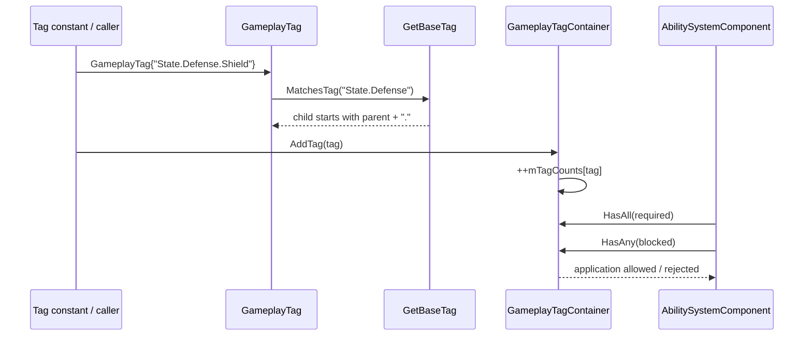

# Gameplay Tag Definition and Lookup Flow

## Amaç

Bir string sabitinin tag'e dönüşmesinden, indexed/hierarchical normalizasyona, counted container lookup'a ve effect application gate'ine kadar gerçek yolu izler.

## Akış



## Adım adım

1. Kod, tag'i doğrudan string kurucuyla veya `inline static const GameplayTag` sabitiyle oluşturur.
2. `WithIndex` gerekiyorsa sona `_N` ekler; `GetBaseTag` yalnız sayısal suffix'i ayırır.
3. `MatchesTag` her iki tarafı base tag'e çevirir.
4. Eşit string doğrudan eşleşir; değilse child, `parent + "."` ile başlamalıdır.
5. Container bir tag'i kaç kaynak verdiğini sayar.
6. `RemoveTag` sayacı sıfıra inmeden entry'yi silmez.
7. Effect gate, required tag'lerin hepsini ve blocked tag'lerin hiçbirini arar.

## Kritik gerçek kod

Dosya: `LightYearsEngine/include/framework/Core.h`  
Sınıf veya namespace: `ly::GameplayTag`  
Fonksiyon: `WithIndex`  
Görevi: Runtime'a özel suffix'li tag üretir.

```cpp
        GameplayTag WithIndex(int index) const
        {
            return GameplayTag{ name + "_" + std::to_string(index) };
        }
```

Dosya: `LightYearsEngine/include/framework/Core.h`  
Sınıf veya namespace: `ly::GameplayTagContainer`  
Fonksiyon: `RemoveTag`  
Görevi: Counted ownership bittiğinde tag'i gerçekten siler.

```cpp
        void RemoveTag(const GameplayTag& tag)
        {
            auto found = mTagCounts.find(tag);
            if (found == mTagCounts.end())
            {
                return;
            }
            if (--found->second <= 0)
            {
                mTagCounts.erase(found);
            }
        }
```

Dosya: `SpaceAbilitySystem/src/AbilitySystemComponent.cpp`  
Sınıf veya namespace: `sas::AbilitySystemComponent`  
Fonksiyon: `CanApplyGameplayEffect`  
Görevi: Required/blocked tag koşullarını tek gate'te değerlendirir.

```cpp
	bool AbilitySystemComponent::CanApplyGameplayEffect(
		const GameplayEffectDefinition& definition
	) const
	{
		return mEffects.CanApplyEffect(definition);
	}
```

## Test ve kaynak doğrulaması

- `GasLiteCoreTests.cpp:745-762`: parent match ve iki ekleme/iki kaldırma.
- `CanApplyGameplayEffect` için required/blocked gate kodda doğrulandı; bu gate'e özel izole test doğrulanamadı.
- Önceki Debug/Release test çalıştırmaları `exit 0` verdi; bu kayıt tarihsel ve
  bu docs-only denetiminde yeniden çalıştırılmadı.
- Commit: `b2e24c11d157c64b89bd1cf47c1390bf72784056`; worktree dirty.

## Okuma sırası

1. `Core.h::GameplayTag`
2. `Core.h::GameplayTagContainer`
3. `AttributeIds.h` oyun attribute tag sabitleri
4. `AbilitySystemComponent.cpp::CanApplyGameplayEffect`
5. İlgili çekirdek test bloğu

## Risk

String registry olmadığı için lookup başarısı doğru yazıma bağlıdır. “Exact” match indexed suffix'i normalize ettiği için ham string equality ile aynı kavram değildir.
