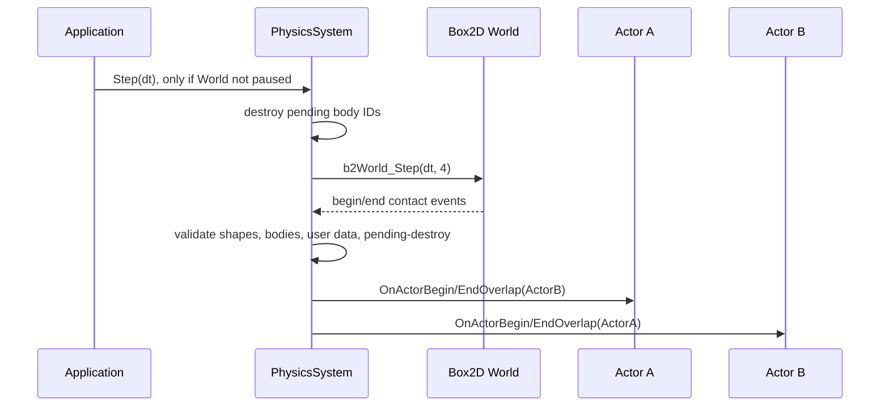

# Physics Step and Contact Flow

Actor `Destroy` veya destructor yolunda physics body removal istenir. Body, `Step` başlangıcındaki deferred listede geçerliyse Box2D'den silinir. World switch ise application physics world'ünü tamamen cleanup edip tekrar initialize eder; eski body'lerin yeni World'e taşınması yoktur.

Overlap dispatch, begin ve end eventlerini ayrı döngülerde işler. Bir taraf pending destroy ise o tarafın callback'i atlanır; diğer taraf yine o anda geçerliyse kendi callback'ini alabilir.

