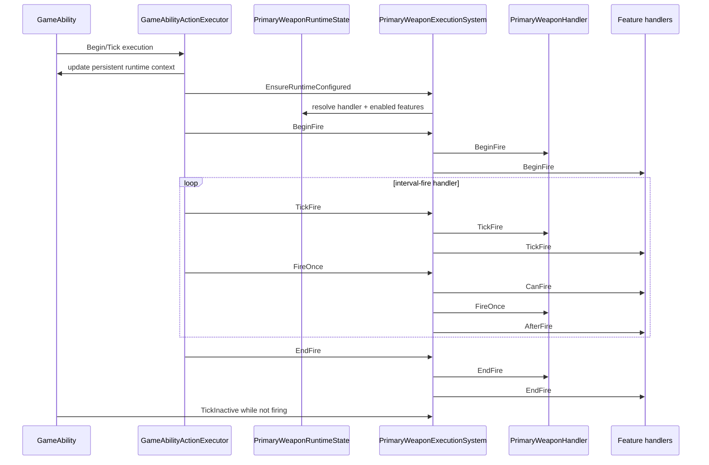

# Primary Weapon Fire Lifecycle

## Amaç

Bu walkthrough, `FireWeaponAction`'ın ability action olarak seçilmesinden primary-weapon handler ve feature hook'larının çalışmasına kadar olan akışı gösterir. Projectile spawn/impact ve combat damage sonuçları burada açılmaz.



## 1. Ability action ve typed runtime

`FireWeaponAction`, `AbilityActionData` variant'ında yalnızca `PrimaryWeaponDefinition` taşır. Executor action'ı seçtiğinde `FireWeaponRuntimeState` oluşturur: resolved/runtime attributes, interval, execution count, lifecycle bayrağı ve geçici veya persistent `PrimaryWeaponRuntimeState` için pointer içerir.

```cpp
struct FireWeaponAction
{
    PrimaryWeaponDefinition weaponDefinition;
};
```

## 2. Persistent runtime seçimi

`FireWeaponActionRuntime::EnsureLifecycle`, action state ilk kez kullanılırken weapon runtime attributes'ını kurar. Bir `GameAbility` varsa `UpdatePrimaryWeaponRuntimeContext` çağrılır ve action state'in `persistentWeaponRuntime` pointer'ı ability'nin `GetPrimaryWeaponRuntime()` sonucuna bağlanır.

Weapon kimliği değiştiğinde instance persistent runtime'ı sıfırlanır. Kimlik aynıysa runtime tekrar kullanılabilir; özellikle feature runtime değerlerinin ateşlemeler arasında korunabilmesinin temelidir.

## 3. Configuration ve begin

`EnsureRuntimeConfigured`, definition'ı doğrular, type tag ile handler'ı ve definition/progression unlocked tag'leriyle etkin feature'ları çözer. Runtime uygun değilse handler'a ait type state'i yeniden kurar. Runtime firing iken handler veya feature set'i değişirse işlem reddedilir.

Başarılı yapılandırmadan sonra `BeginFire` önce handler'ı, ardından her enabled feature'ı çağırır. Lifecycle `state.lifecycleStarted` ile executor tarafında izlenir; weapon runtime kendi `isFiring` bayrağını tutar.

## 4. Tick, interval ve single fire

Executor action tick'inde önce weapon fire interval'ini azaltır. Başlatılmamış lifecycle interval bekliyorsa instance'taki weapon interval değeri güncellenir ve fire atlanır. Başlatılmış lifecycle için sıralama:

1. `PrimaryWeaponExecutionSystem::TickFire`.
2. Feature'ın istediği cooldown varsa executor `EndFire` yapar ve interval'i en az bu cooldown kadar ileri alır.
3. Handler interval-fire kullanıyorsa `intervalRemaining <= 0` oldukça `FireOnce` çağrılır; action `maxExecutions` sınırı da kontrol edilir.
4. Başarılı fire execution count artırır ve yeni effective interval eklenir.

`FireOnce` feature `CanFire` gate'lerinden geçmeden handler'ı çağırmaz. Handler başarılı fire sonrasında feature `AfterFire` hook'ları çalışır.

## 5. End ve inactive tick

Ability execution bittiğinde veya cancel olduğunda executor, başlamış fire action için `FireWeaponActionRuntime::End` çağırır; bu da `PrimaryWeaponExecutionSystem::EndFire` üzerinden handler ve enabled feature end hook'larını çalıştırıp `isFiring` değerini kapatır.

`GameAbility::TickInactivePrimaryWeaponRuntime`, ability'de initialize edilmiş ama firing olmayan persistent runtime için `PrimaryWeaponExecutionSystem::TickInactive` çağrısı yapar. Böylece feature'lar, örneğin heat dissipation, ability aktif olmayınca da update alabilir.

## Başarısızlık sınırları

| Nokta | Sonuç |
|---|---|
| Invalid definition veya handler/feature çözümlemesi | Lifecycle başlamaz |
| Firing sırasında runtime type/feature değişimi | `EnsureRuntimeConfigured` başarısız olur |
| Feature `CanFire` reddi | Handler `FireOnce` çalışmaz |
| Requested weapon cooldown | Executor `EndFire` yapar ve interval'i bekletir |
| `UsesIntervalFire() == false` | Tick içinde generic repeated `FireOnce` döngüsü çalışmaz |

## Kod okuma sırası

1. `GameAbilityDefinition.h::FireWeaponAction`
2. `AbilityExecution.h::FireWeaponRuntimeState`
3. `FireWeaponActionRuntime.cpp::EnsureLifecycle`
4. `PrimaryWeaponExecutionSystem.cpp::EnsureRuntimeConfigured`
5. `PrimaryWeaponExecutionSystem.cpp::BeginFire`, `FireOnce`, `TickFire`, `EndFire`
6. `GameAbility.cpp::TickInactivePrimaryWeaponRuntime`

## Kaynak doğrulaması

- Son doğrulanan commit: `b2e24c11d157c64b89bd1cf47c1390bf72784056`.
- Çalışma ağacı dirty durumdadır; test veya build bu aşamada çalıştırılmadı.
