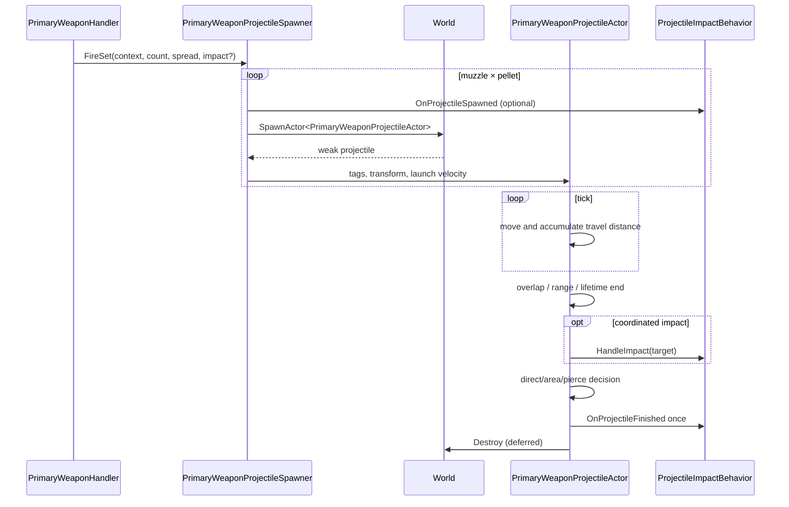

# Primary Weapon Projectile Lifecycle

## 7 Eylül 2026 kaynak kontrolü

Constructor Box2D body açmaz; SetAbilityPhysicsEnabled(false). Move içindeki swept contact sonucu OnActorBeginOverlap/impact yoluna gider. “Physical projectile” ifadesi hareket eden mermi anlamındadır, Box2D gövdesi değil. Kaynak: PrimaryWeaponProjectileActor.cpp; tüm relay/portal dalları incelenmedi.

Bu ek kaynak incelemesidir; build/test çalıştırılmadı. Aşağıdaki eski örnekler tarihsel inceleme kapsamını taşır; bu güncelleme ile çelişen ayrıntılar güncel davranış kabul edilmemeli.

## Amaç

Bu walkthrough, standard/shotgun handler'ın fire çağrısından projectile actor'ın spawn, hareket, impact ve cleanup'ına kadar olan yolu izler. Damage hesap formülleri ile World'ün genel deferred-destroy mekanizması ilgili sistem notlarında kalır.

## 1. Handler'dan FireSet'e

`StandardProjectileWeaponHandler::FireOnce`, base projectile sayısına `AdditionalProjectileCount` attribute'unu ekleyerek `FireSet` çağırır. `ShotgunWeaponHandler`, pellet count ve spread angle kullanır; per-additional-hit reduction etkinse ayrıca shared `ShotgunVolleyImpactGroup` verir.

`FireSet`, projectile count'i en az `1` yapar. Her muzzle için fire direction hesaplanır, carrier velocity bir kez çözülür ve her pellet'e aynı carrier velocity atanır. Spread, ilk ve son pellet arasında simetrik dağıtılır.

## 2. Spawn yapılandırması

Spawner önce owner world'ünün varlığını kontrol eder. Optional impact behavior varsa spawn girişiminden önce `OnProjectileSpawned` çağrılır. Spawn başarılı olduğunda projectile'a aşağıdakiler atanır:

- impact behavior ve damage tags;
- owner location + local muzzle offset;
- owner rotation + muzzle offset + pellet spread offset;
- forward projectile speed ile carrier velocity'nin toplamı.

Spawn sonucu weak pointer kilitlenemezse spawner impact behavior'a `OnProjectileFinished` çağrısı yapar; bu shotgun group'un bekleyen pellet sayısının açıkta kalmasını önler.

## 3. Flight

Projectile constructor'ı delivery attributes'tan speed, range, lifetime, collision radius, area radius ve pierce count'i kurar. İlk `Move` çağrısında spawner tarafından velocity verilmemişse forward direction × speed fallback'i kullanır. Her tick, launch velocity ile konumu taşır ve bu velocity'nin uzunluğunu travel distance'e ekler.

Range pozitif ve travel distance sınırı aşılmışsa `Destroy` çağrılır. Lifetime kontrolü base `AbilityWorldActor` tick'inde yürür.

## 4. Overlap ve karar ağacı

`OnActorBeginOverlap`, collision etkin olduğunda aşağıdaki kararları verir:

| Koşul | Sonuç |
|---|---|
| Impact behavior geçerli target'ı ele alır ve `true` döner | Direct projectile damage atlanır, destroy |
| Area radius > 0 | Area damage yolu, ardından destroy |
| Area yok ve pierce > 0 | Pierce azaltılır, projectile devam eder |
| Diğer durum | Direct impact damage yolu, ardından destroy |

Damage çağrılarının hedef/amount/type çözümü burada açıklanmaz; [[Combat and Damage System]] kapsamındadır.

## 5. Finalization

`Destroy`, idempotent olacak şekilde pending-destroy kontrolü yapar. Bir impact behavior varsa `OnProjectileFinished` sadece ilk destroy çağrısında çalışır; ardından projectile performans sayacı azaltılır ve `Actor::Destroy` üzerinden World cleanup yoluna girilir.

Shotgun volley group bu completion çağrılarını sayar; son pellet tamamlandığında target bazında topladığı impact kayıtlarını resolve eder. Bu, projectile actor ile shotgun'a özgü damage coordination arasında açık bir extension sınırıdır.

## Kod okuma sırası

1. `StandardProjectileWeaponHandler.cpp::FireOnce`
2. `ShotgunWeaponHandler.cpp::FireOnce`
3. `PrimaryWeaponProjectileSpawner.cpp::FireSet`
4. `PrimaryWeaponProjectileActor.cpp` constructor ve `Tick`
5. `PrimaryWeaponProjectileActor.cpp::OnActorBeginOverlap`
6. `ProjectileImpactBehavior.h` ve `ShotgunVolleyImpactGroup.cpp`

## Kaynak doğrulaması

- Son doğrulanan commit: `b2e24c11d157c64b89bd1cf47c1390bf72784056`.
- Çalışma ağacı dirty durumdadır; test veya build bu aşamada çalıştırılmadı.
