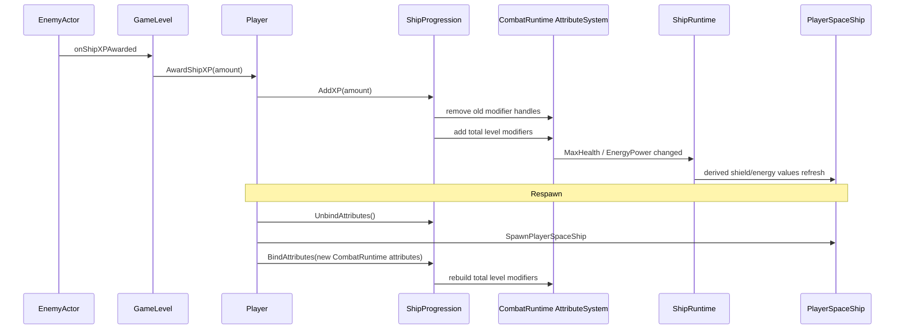

# Ship Progression and Respawn Flow

## Amaç

Bu walkthrough, enemy XP ödülünün player progression state'ine ulaşmasını, level modifier'larının active ship'e uygulanmasını ve respawn'da aynı progression state'inin güvenli biçimde yeni runtime'a bağlanmasını gösterir.

## 1. XP award

`GameLevel`, enemy'nin score delegate'inden ayrı olarak `onShipXPAwarded` delegate'ini `Player::AwardShipXP`e bağlar. Player, amount'ı doğrudan `ShipProgression::AddXP`e yollar. Negative veya zero XP state'i değiştirmez.

## 2. Level geçişi

`AddXP`, XP yeterli olduğu sürece loop ile level yükseltir; her geçişte current level'a göre yeni gereksinim hesaplanır. Level değişirse yalnız bir kez `RebuildLevelModifiers` çağırır ve `onLevelChanged(previous, current)` yayınlar.

`RebuildLevelModifiers`, old modifier handle'larını bound attribute system'den kaldırır, sonra `(level - 1)` tamamlanmış level sayısına göre total Add modifier'ları ekler. Bu nedenle aynı attribute'a her level için ayrı kalıcı modifier yığılmaz.

## 3. Derived ship values

Level bonusları owner `MaxHealth` veya `EnergyPower`i değiştirebilir. `ShipRuntime`, bu iki owner attribute değişikliğini dinler ve derived health regen, shield values, afterburner values ve owner afterburner regen'i yeniden hesaplar. `SpaceShip` de runtime attribute değişiminde health/shield/energy/movement component değerlerini refresh eder.

## 4. Respawn rebind

`Player::SpawnSpaceShip` başlamadan progression binding'ini kaldırır. Bu deliberately old attribute runtime'a modifier removal çağırmaz; old ship aynı anda destruction aşamasında olabilir. Yeni ship spawn edildikten sonra progression henüz configure edilmemişse fighter config'i ile configure edilir, ardından yeni `CombatRuntime` attributes'a bind edilir.

Bind işleminde modifier handle listesi temizlenir ve deterministic total bonus yeni attribute system üzerinde yeniden oluşturulur. Böylece XP/level state Player'da kalırken active ship runtime'ı değişebilir.

## 5. Reset

Run bittiğinde `Player::ResetRunProgression`, ShipProgression XP/level state'ini resetler, ability purchase state'ini temizler ve scrap'i sıfırlar. Normal ship destruction yalnız unbind yapar; XP/leveli sıfırlamaz.

## Doğrulanan sınırlar

| Alan | Durum |
|---|---|
| Ship XP award → level modifiers | Implemented |
| Respawn sırasında rebind | Implemented |
| Ability purchased level restore | Player tarafından ayrı mekanizma; ayrıntı sonraki Ability Progression aşaması |
| Save/load persistence | Doğrulanamadı |
| Birden çok seçilebilir player ship için progression config seçimi | Doğrulanamadı |

## Kaynak doğrulaması

- Son doğrulanan commit: `b2e24c11d157c64b89bd1cf47c1390bf72784056`.
- Dirty worktree incelendi; test/build bu aşamada çalıştırılmadı.
