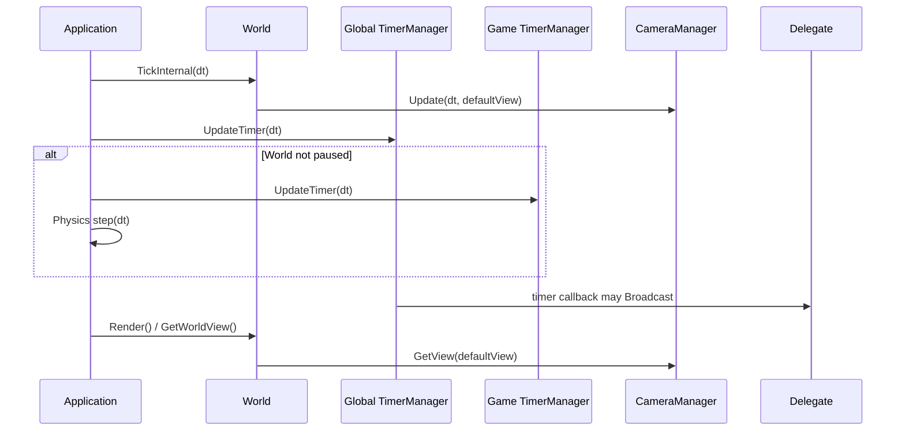

# Timer, Delegate and Camera Frame Flow

## Timer execution

`TimerManager::UpdateTimer` önce mevcut kaydın expired olup olmadığını kontrol eder; expired ise erase eder, değilse `TickTimer(dt)` çağırır. `TickTimer`, süre dolunca callback'i çalıştırır; tek seferlik timer'ı expired işaretler, repeat timer'ın sayacını sıfırlar. Bu nedenle tek seferlik timer fiziksel olarak aynı pass içinde değil, sonraki update'in erase adımında listeden çıkar.

## Weak callback cleanup

Timer, `weak_ptr<Object>` ile callback taşır. Owner expired veya pending-destroy ise `IsExpired` true olur ve callback çağrılmaz. Delegate weak binding de benzer şekilde expired owner için `false` döner; fakat delegate listener'ı timer gibi frame tick'te değil, sonraki `Broadcast` sırasında listeden kaldırılır.

## Camera update ve render

Follow target yoksa veya pending destroy ise CameraManager mevcut state'i varsayılan view ile başlatır/korur ve target-follow hesaplamasını atlar. Hedef varsa desired center/zoom hesaplanır, center exponential smoothing ile, zoom ise critically damped scalar smoothing ile güncellenir. Render aşamasında `World` bu state'ten `sf::View` oluşturur, shake offset'i yalnız view'a eklenir.

## Pause ve world geçişi

Pause, game timer ve physics update'ini durdurur; global timer update devam eder. Pending World switch tespit edildiğinde game/global timerlar temizlenir, physics cleanup + world initialize edilir, sonra yeni World `BeginPlayInternal` çağrısını alır. Bu, timerın eski World callback'ini taşımasını normal geçiş yolunda engeller.

