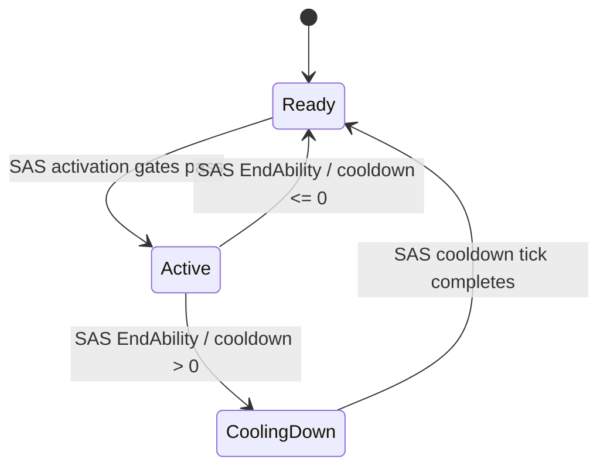

# AbilityInstance

## Güncel ayrım

Eski `ly::GameAbilityInstance` kaldırılmıştır. Generic instance sorumluluğu
`sas::GameplayAbilityInstance<Definition, Execution>` içindedir.

SAS tabanı input, activation, end, cooldown, duration, charge, level ve snapshot
akışını yürütür. `AbilityRuntimeEntry` handle/base definition/resolved
definition/runtime state/execution storage'ını sağlar.

`ly::GameAbility` bu tabanın Light Years content uzantısıdır. Yalnız concrete
behavior/action dispatch'i, weapon runtime ve attachment loadout işlemlerini
uygular. Framework lifecycle kararı içermez.

## State akışı

## Durum

Kod taşındı; build/test tüm SAS geçişi sonunda çalıştırılacaktır.
