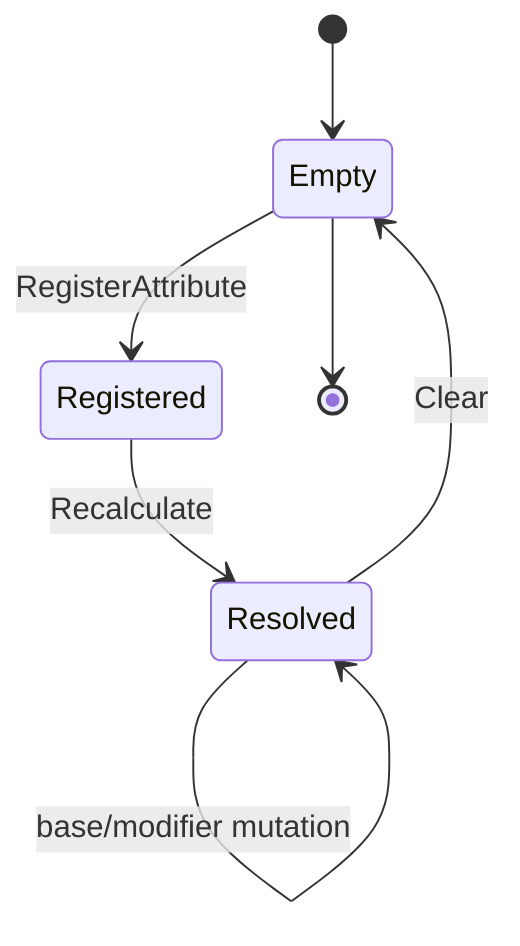

# AttributeSystem

## Rol

`sas::AttributeSystem`, bir runtime sahibi için tag→attribute storage, handle→modifier ownership, resolved-value cache ve change notification sınırıdır.

Sınıf statik `SpaceAbilitySystem` target'ının Attribute aşamasında
`LightYearsGame` dışına taşınmıştır. Public API `sas` namespace'indedir; gemiye
özgü ID ve formüller bu sınıfın parçası değildir. Taşıma sonrası toplu
build/test, Ability ve Effect aşamalarından sonra yapılacaktır.

## Sorumluluklar

- Attribute register/read ve base mutation.
- Geçici modifier handle üretimi ve removal.
- Add/Multiply/Override/clamp çözümü.
- Sequential reduction için özel multiplier çözümü.
- Revision ve delegate yayınları.
- Normal clear.

## Sorumlu olmadığı işler

- Rating eğrileri: `AttributeMath`.
- Ship-derived formülleri: `ShipRuntime`.
- Effect süre/stack sahipliği: `sas::GameplayEffectRuntimeSystem` üzerinden `sas::AbilitySystemComponent`.
- Ability/weapon-local scaling sırası: ilgili resolver'lar.
- Tag doğrulama/registry: mevcut değildir.

## Tanım ve sahip

| Alan | Değer |
|---|---|
| Header | `SpaceAbilitySystem/include/attributes/AttributeSystem.h` |
| Implementation | `SpaceAbilitySystem/src/attributes/AttributeSystem.cpp` |
| Base class | Yok |
| Ana owner | `CombatRuntime::mAbilitySystemComponent.GetAttributes()`; ayrıca `ShipRuntime` attribute runtime'ı |
| Lifetime | Owner runtime ile aynı |

## Ana üyeler

| Üye | Tip | Anlam |
|---|---|---|
| `mAttributes` | tag→`GameplayAttributeEntry` dictionary | Değer ve modifier storage |
| `mHandleToAttribute` | handle ID→tag map | O(lookup) removal yönlendirmesi |
| `mNextHandleId` | unsigned int | Modifier handle allocator |
| `mRevision` | uint64 | Cache invalidation epoch |
| `onAttributeChanged` | Delegate<tag,old,new> | Push notification |
| `onAttributeRegistered` | Delegate<tag> | İlk kayıt bildirimi |
| `onAttributesCleared` | Delegate<> | Clear bildirimi |

## Kullanan ana sistemler

`CombatRuntime`, `ShipRuntime`, `sas::AbilitySystemComponent`, `SpaceShip`, ability/weapon resolver'ları, attachment/progression ve `GasLiteCoreTests` bu sınıfın gerçek kullanıcılarıdır. Effect runtime geçici modifier handle'larını; `FireWeaponActionRuntime` ve `AbilityActionAttributeResolver` revision değerini tüketir.

## Ana fonksiyonlar

| Fonksiyon | Caller örnekleri | Callee / sonuç |
|---|---|---|
| `RegisterAttribute` | CombatRuntime, ShipRuntime | storage + `Recalculate` |
| `SetBaseValue` | ShipRuntime | clamp + `Recalculate` |
| `ApplyBaseModifier` | instant effect, progression | kalıcı base değişikliği |
| `AddModifier` | `GameplayEffectRuntimeSystem` | handle üretimi |
| `RemoveModifier` | `GameplayEffectRuntimeSystem` | handle cleanup |
| `Recalculate` | tüm mutation yolları | resolved value + notification |
| `GetRevision` | `FireWeaponActionRuntime`, `AbilityActionAttributeResolver` | cache invalidation |

## Initialization, runtime, cleanup



## Kritik gerçek kod

Dosya: `SpaceAbilitySystem/include/attributes/AttributeSystem.h`  
Sınıf veya namespace: `sas::AttributeSystem`  
Fonksiyon: public yüzey  
Görevi: Storage mutation ve read kontratını tanımlar.

```cpp
		void SetBaseValue(const GameplayTag& id, float baseValue);
		void ApplyBaseModifier(const AttributeModifier& modifier);
		AttributeModifierHandle AddModifier(const AttributeModifier& modifier);
		void RemoveModifier(AttributeModifierHandle handle);
		void Clear();
```

Dosya: `SpaceAbilitySystem/src/attributes/AttributeSystem.cpp`  
Sınıf veya namespace: `sas::AttributeSystem`  
Fonksiyon: `RegisterAttribute`  
Görevi: Kayıt/overwrite ve registered bildirimi.

```cpp
		const bool alreadyRegistered = HasAttribute(attribute.id);
		GameplayAttributeEntry& entry = mAttributes[attribute.id];
		entry.attribute = attribute;
		Recalculate(attribute.id);
		++mRevision;
		if (!alreadyRegistered)
		{
			onAttributeRegistered.Broadcast(attribute.id);
		}
```

Dosya: `SpaceAbilitySystem/src/attributes/AttributeSystem.cpp`  
Sınıf veya namespace: `sas::AttributeSystem`  
Fonksiyon: `Clear`  
Görevi: Storage ve allocator'ı sıfırlar, clear epoch'u yayınlar.

```cpp
		mAttributes.clear();
		mHandleToAttribute.clear();
		mNextHandleId = 1;
		++mRevision;
		onAttributesCleared.Broadcast();
```

## Testler

- Modifier order, removal ve instant base modifier.
- Sequential reduction.
- Derived/rating kullanımları dolaylı integration kapsamına sahiptir.
- Eksik: Override priority/tie, delegate count, unchanged-value sessizliği, handle overflow.

## Riskler

- Eşit-priority Override sonucu unordered traversal'a bağlıdır.
- Exact float comparison notification gürültüsü üretebilir.
- Duplicate resolution helper gelecekte `Recalculate` ile ayrışabilir.
- Raw `this` delegate binding kullanan `ShipRuntime` için unbind/lifetime kontratı ayrıca gözden geçirilmelidir.

## Kod okuma sırası

1. `GameplayAttribute`
2. Modifier/handle/entry tipleri
3. `AttributeSystem` public API
4. Mutation fonksiyonları
5. `Recalculate`
6. Subscriber ve revision tüketicileri

## Kaynak doğrulaması

Commit tabanı aynı; dirty worktree incelendi. Bilgi grafiği public mutation
yollarının `Recalculate`'a bağlandığını, literal arama gerçek subscriber/cache
tüketicilerini doğruladı. Debug ve Release `exit 0` ile 2026-07-29 CTest
2/2 sonucu tarihsel kayıttır; bu docs-only denetiminde güncel build/test
çalıştırılmadı.
