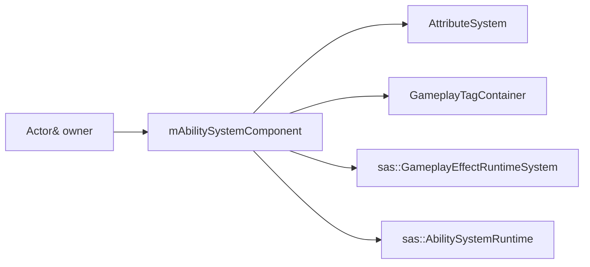

# CombatRuntime

## Rol

`ly::CombatRuntime`, bir combat actor için owner attribute/tag/effect/ability state'ini `mAbilitySystemComponent` üzerinden ve presentation/guard yardımcılarını value member olarak aynı lifetime sınırında birleştiren composition root'tur.

## Sorumluluklar

- Sibling runtime sistemlerini doğru referanslarla kurmak.
- Çekirdek owner attribute'larını initialize etmek.
- Effect → ability tick sırasını korumak.
- Incoming damage'da effect/status aşamasını ve shield sonrası ortak hull Armor hesabını koordine etmek.
- Ability/effect/tag/attribute clear sırasını yönetmek.

## Sorumlu olmadığı işler

- Ship-specific shield/afterburner derivation: `ShipRuntime`; kalıcı ship shield state'i `ShieldComponent`.
- Actor/component lifetime: owner `Combatant`/`SpaceShip`.
- Effect policy ayrıntısı: `sas::GameplayEffectRuntimeSystem`, facade: `sas::AbilitySystemComponent`.
- Attribute resolution ayrıntısı: `AttributeSystem`.
- Ability behavior ayrıntısı: `GameAbility` / `GameAbilityBehavior`.

## Tanım ve sahip

| Alan | Değer |
|---|---|
| Header | `LightYearsGame/include/gameplay/combat/CombatRuntime.h` |
| Implementation | `LightYearsGame/src/gameplay/combat/CombatRuntime.cpp` |
| Base class | Yok |
| Owner örnekleri | `SpaceShip::mCombatRuntime`, test `TestCombatant::mCombatRuntime` |
| Child lifetime | Value members; CombatRuntime ile aynı |

## Üye kuruluş sırası



## Kullandığı veri tipleri ve kullanan sistemler

| Veri/sistem | İlişki |
|---|---|
| `LightYearsAbilitySystemComponent` | Value member; SAS attribute/tag/effect/ability storage ve game adapter |
| `sas::GameplayEffectRuntimeSystem` | Component-owned typed effect runtime |
| `sas::AbilitySystemRuntime<GameAbilityDefinition, GameAbility>` | Component-owned typed ability runtime |
| `DamageContext` | Incoming damage çağrı verisi; sahiplenilmez |
| `Actor* mOwner` | Non-owning target/owner pointer |

`Combatant`, `SpaceShip`, damage helper'ları, ability/effect producer'ları ve GAS-Lite test fixture'ı bu composition root'u kullanır.

## Kritik gerçek kod

Dosya: `LightYearsGame/src/gameplay/combat/CombatRuntime.cpp`  
Sınıf veya namespace: `ly::CombatRuntime`  
Fonksiyon: constructor  
Görevi: Effect ve ability sistemlerine aynı owner/attribute/tag nesnelerini bağlar.

```cpp
		: mOwner{ owner },
		mAbilitySystemComponent{ owner }
	{
	}
```

Dosya: `LightYearsGame/src/gameplay/combat/CombatRuntime.cpp`  
Sınıf veya namespace: `ly::CombatRuntime`  
Fonksiyon: `Clear`  
Görevi: Bağımlılık sırasına uygun cleanup uygular.

```cpp
		mAbilitySystemComponent.Clear();
		mEffectPresentation.Clear();
		mPendingEffectEvents.clear();
```

Dosya: `LightYearsGame/src/gameplay/combat/CombatRuntime.cpp`  
Sınıf veya namespace: `ly::CombatRuntime`  
Fonksiyon: `ProcessIncomingDamage`  
Görevi: Incoming effect ve status aşamasını çözer; Armor, hedefin shield/overshield emiliminden sonra çağrılır.

```cpp
		mCombatRuntime.ApplyHullDamageMitigation(context);
```

## Initialization, runtime, cleanup

1. Owner constructor içinde value member olarak oluşur.
2. `InitializeOwnerAttributes` owner stat setini register eder.
3. Owner tick'i `CombatRuntime::Tick` çağırır.
4. Damage pipeline `ProcessIncomingDamage` ve `NotifyDamageResolved` kullanır.
5. Respawn/teardown öncesi `Clear` child sistemleri dependency sırasıyla boşaltır.

## Caller / callee

- Caller: `Combatant` implementasyonları, `SpaceShip`, damage helper'ları.
- Callee: `AttributeMath`, `sas::AbilitySystemComponent`, typed effect/ability runtimes, `DamageTypeSystem`, delegates.
- `SpaceShip::Tick`, movement'tan sonra CombatRuntime'ı tick eder.

## Testler

- Test combatant gerçek CombatRuntime composition'ı kullanır.
- Rating, effect, damage, barrier, ability ve movement entegrasyonları aynı executable'da çalışır.
- Child clear sırası ve dangling reference için özel lifetime testi bulunamadı.
- 21 Eylül 2026 doğrulaması: `cmake --build build --parallel 4`, `cmake --build build --target LightYearsGame --parallel 4` ve `LightYearsGasLiteTests.exe` başarıyla çalıştı; test executable'ı exit code `0` döndürdü.

## Riskler

- Child sistemler sibling'lere raw pointer/reference tutar; member declaration order ve owner lifetime kritik kontrattır.
- `InitializeOwnerAttributes` `MovementSlow` kaydetmez; ilk modifier uygulaması auto-register eder.
- Damage pipeline geniştir; üst seviye sıra için [[Combat and Damage System]] ve [[Damage and Shield Resolution Flow]].

## Kod okuma sırası

1. `CombatRuntime.h` member declaration sırası
2. Constructor
3. `InitializeOwnerAttributes`
4. `Tick`
5. `Clear`
6. Incoming damage bağlantısı

## Kaynak doğrulaması

Commit tabanı aynı; dirty worktree incelendi. Bilgi grafiği `CombatRuntime` ve `GetCombatRuntime` referanslarını, doğrudan kaynak okuması member construction/tick/clear sırasını doğruladı.
