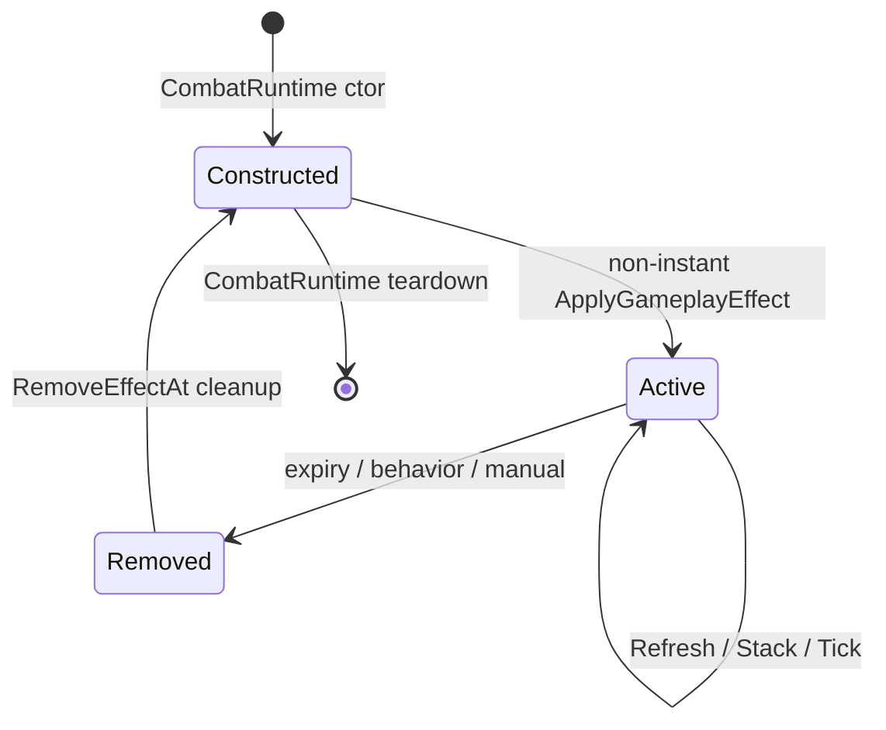

# GameplayEffectSystem

## Rol

`sas::AbilitySystemComponent`, effect facade'ıdır; `mEffects` üyesi `sas::GameplayEffectSystem` alias'ı üzerinden typed `GameplayEffectRuntimeSystem<GameplayEffectSpec, ActiveGameplayEffect>` sahibidir. Oyun tarafı `CombatRuntime` callback'leriyle behavior, damage ve presentation adaptasyonunu bağlar.

## Sorumluluklar

- Definition/spec overload'larını kanonik apply yoluna indirmek.
- SAS helper üzerinden required/blocked tag gate.
- SAS lifecycle orchestrator üzerinden application, source-scope stacking,
  refresh/stack ve duration expiry kararları.
- Instant, Duration ve Infinite policy.
- None, RefreshDuration ve Stack policy.
- Active list ve handle yönetimi.
- SAS binding helper üzerinden attribute modifier ve granted tag ownership.
- Behavior hook, incoming-damage dispatch ve pending owner event'leri.
- Snapshot, delegate ve visual state bağlantısı.

## Sorumlu olmadığı işler

- Shipped content oluşturma/kayıt: `EffectContentCatalog` ve `EffectLoader`.
- Definition validation: `GameplayEffectValidation`.
- Feature-specific tick/damage davranışı: registered `GameplayEffectBehavior`.
- Attribute formülü: `AttributeSystem`.
- Presentation çizimi: visual registry/actor.

## Tanım ve sahip

| Alan | Değer |
|---|---|
| Facade header | `SpaceAbilitySystem/include/AbilitySystemComponent.h` |
| Facade implementation | `SpaceAbilitySystem/src/AbilitySystemComponent.cpp` |
| Effect alias | `SpaceAbilitySystem/include/effects/GameplayEffectSystem.h` |
| Owner | `CombatRuntime::mAbilitySystemComponent` |
| Constructor refs | `AbilitySystemComponent` default state; callbacks are installed by `CombatRuntime` |
| Core runtime | `sas::GameplayEffectRuntimeSystem<GameplayEffectSpec, ActiveGameplayEffect>` |

## Ana üyeler

| Üye | Tip | Ownership |
|---|---|---|
| `mAttributes` | `AttributeSystem` | Component-owned attribute state |
| `mOwnedTags` | `GameplayTagContainer` | Component-owned tag state |
| `mEffects` | `sas::GameplayEffectSystem` | Owning typed SAS lifecycle component |
| `mEffectBindings` | `EffectCallbacks` | Callback configuration copied into the runtime |
| `mGameplayEventHandler` | type-erased handler | Optional gameplay-event adapter |

## Ana fonksiyonlar

| Fonksiyon | Rol |
|---|---|
| `ApplyGameplayEffect` | Definition/spec'i typed runtime'a iletir |
| `RefreshGameplayEffectDuration` | State'i yıkmadan duration reset |
| `Tick` | Effect tick'i ve ability runtime tick'ini sıralar |
| `RemoveGameplayEffect` / `RemoveGameplayEffectsIf` | Facade üzerinden cleanup |
| `BuildGameplayEffectSnapshots` | UI/read copy |
| `Clear` | Tüm effect'leri normal removal |

## Initialization, runtime, cleanup



## Kritik gerçek kod

Dosya: `SpaceAbilitySystem/src/AbilitySystemComponent.cpp`  
Sınıf veya namespace: `sas::AbilitySystemComponent`  
Fonksiyon: `ApplyGameplayEffect`  
Görevi: Definition/spec'i `mEffects` typed runtime'ına iletir.

```cpp
	return mEffects.ApplyEffect(definition, context);
```

Dosya: `SpaceAbilitySystem/include/effects/GameplayEffectRuntimeSystem.h`  
Sınıf veya namespace: `sas::GameplayEffectRuntimeSystem`  
Fonksiyon: Stack branch  
Görevi: Max stack sınırına kadar modifier handle ve behavior stack state'i ekler.

```cpp
					const bool stackAdded =
						GameplayEffectLifecycleOrchestrator::ApplyStackingState(
							applicationKind,
							*stackingTarget,
							spec.duration,
							spec.maxStacks
						);
					if (stackAdded)
					{
						AddStack(*stackingTarget);
					}
```

Dosya: `SpaceAbilitySystem/include/effects/GameplayEffectRuntimeSystem.h`  
Sınıf veya namespace: `sas::GameplayEffectRuntimeSystem`  
Fonksiyon: `RemoveModifiers`  
Görevi: Effect'in sahip olduğu tüm geçici modifier'ları geri alır.

```cpp
			RemoveGameplayEffectModifiers(effect, mAttributes);
```

Dosya: `SpaceAbilitySystem/include/effects/GameplayEffectRuntimeSystem.h`  
Sınıf veya namespace: `sas::GameplayEffectRuntimeSystem`  
Fonksiyon: `BuildSnapshots`  
Görevi: Mutable active state'ten kopya read model üretir.

```cpp
			snapshots.push_back(effect.BuildRuntimeSnapshot());
```

## Caller / callee

- Caller: ability action, area applicator, reward ve test; `CombatRuntime` tick/damage/clear.
- Callee: `AttributeSystem`, `GameplayTagContainer`, `GameplayEffectBehavior`, visual registry ve delegates.
- Bilgi grafiğinde kanonik `ApplyEffect` 5 doğrudan inbound ve 42 outbound ilişkiyle yüksek bağlantılıdır.

## Testler

- Catalog/spec isolation/validation.
- Barrier state ve incoming damage.
- Gravity source scope, refresh, expiry, movement ve visual cleanup.
- Önceki Debug/Release exit `0` kaydı tarihsel; bu docs-only denetiminde
  güncel build/test çalıştırılmadı.
- Eksik: küçük, bağımsız policy matrix; invalid duration; delegate reentrancy.

## Riskler

- Active list pointer/reference stabilitesi mutation sonrası garanti değildir.
- Refresh tam teardown/rebuild yaparken `RefreshEffectDuration` yalnız timer resetler; caller doğru semantiği seçmelidir.
- Apply içinde ayrılan fakat refresh/stack eşleşmesinde kullanılmayan handle ID'ler boşluk bırakır; uniqueness etkilenmez.
- Dirty worktree commitlenmiş CI ile doğrulanmamıştır.

## Kod okuma sırası

1. Definition/Spec/Active tipleri
2. `AbilitySystemComponent` public API
3. Kanonik `ApplyGameplayEffect`
4. `Tick`
5. Damage dispatch
6. Modifier/tag helper'ları
7. `RemoveEffectAt`

## Kaynak doğrulaması

Commit: `f83fe57b44777de4c31799b4e8bafac04a18700d`; state dirty. Effect facade, typed SAS runtime ve oyun callback bağları doğrudan kaynaklardan doğrulandı; bu doküman güncellemesinde build/test çalıştırılmadı.
